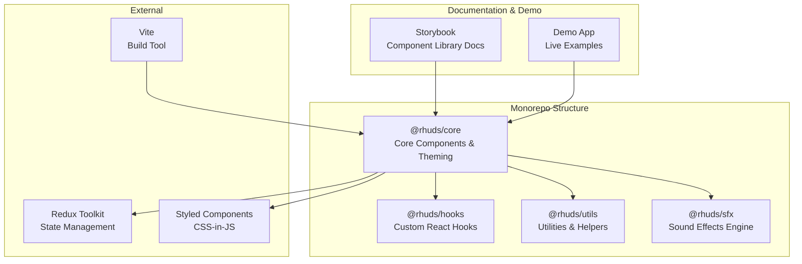
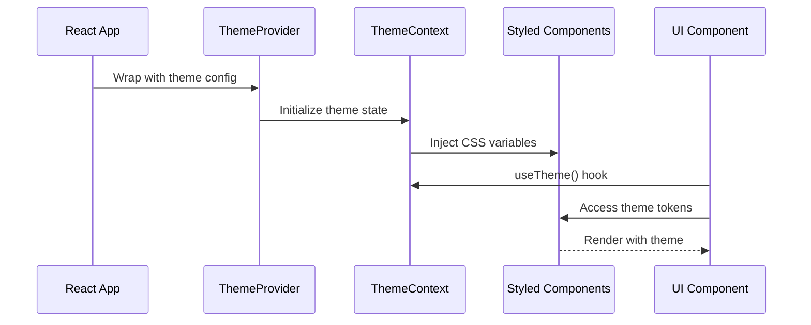
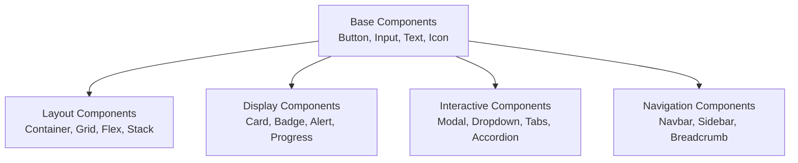

# Design Document: RHUDS (Reactive HUD UI Design System)

## Overview

RHUDS is a comprehensive, production-ready React-based UI design system with HUD (Heads-Up Display) aesthetics inspired by Arwes. It provides a complete component library, theming system, and developer tools for building futuristic, sci-fi interfaces with neon glows, sharp lines, and micro-interactions. The system is built with TypeScript, supports multiple theme modes (light/dark/custom neon colors), includes sound effects for interactions, and prioritizes accessibility, performance, and developer experience through Storybook documentation and extensive test coverage.

## Architecture



## System Architecture

### 1. Theming System Architecture



### 2. Component Hierarchy



## Core Interfaces and Types

### Theme System Types

```typescript
// Theme token definitions
interface ThemeTokens {
  colors: {
    primary: string
    secondary: string
    accent: string
    background: string
    surface: string
    text: string
    border: string
    success: string
    warning: string
    error: string
    info: string
  }
  spacing: Record<string, string>
  typography: {
    fontFamily: string
    fontSize: Record<string, string>
    fontWeight: Record<string, number>
    lineHeight: Record<string, number>
  }
  shadows: Record<string, string>
  transitions: {
    fast: string
    normal: string
    slow: string
  }
  breakpoints: Record<string, string>
}

interface ThemeMode {
  name: 'light' | 'dark' | 'neon-green' | 'neon-blue' | 'neon-red'
  tokens: ThemeTokens
}

interface ThemeContextValue {
  currentMode: ThemeMode
  availableModes: ThemeMode[]
  setTheme: (mode: ThemeMode['name']) => void
  customizeToken: (path: string, value: string) => void
}
```

### Component Base Types

```typescript
// Base component props interface
interface BaseComponentProps {
  className?: string
  style?: React.CSSProperties
  testId?: string
  ariaLabel?: string
  ariaDescribedBy?: string
}

// Button component interface
interface ButtonProps extends BaseComponentProps {
  variant?: 'primary' | 'secondary' | 'ghost' | 'danger'
  size?: 'sm' | 'md' | 'lg'
  disabled?: boolean
  loading?: boolean
  onClick?: (e: React.MouseEvent) => void
  children: React.ReactNode
  icon?: React.ReactNode
  iconPosition?: 'left' | 'right'
  fullWidth?: boolean
  soundEffect?: boolean
}

// Input component interface
interface InputProps extends BaseComponentProps {
  type?: 'text' | 'email' | 'password' | 'number' | 'search'
  placeholder?: string
  value?: string
  onChange?: (e: React.ChangeEvent<HTMLInputElement>) => void
  disabled?: boolean
  error?: boolean
  errorMessage?: string
  icon?: React.ReactNode
  size?: 'sm' | 'md' | 'lg'
  soundEffect?: boolean
}

// Card component interface
interface CardProps extends BaseComponentProps {
  variant?: 'elevated' | 'outlined' | 'filled'
  interactive?: boolean
  onClick?: () => void
  children: React.ReactNode
  header?: React.ReactNode
  footer?: React.ReactNode
  padding?: 'sm' | 'md' | 'lg'
}
```

### State Management Types

```typescript
// Redux store shape
interface RHUDSState {
  theme: {
    currentMode: ThemeMode['name']
    customTokens: Record<string, string>
  }
  ui: {
    openModals: string[]
    activeDropdowns: string[]
    notifications: Notification[]
  }
  sfx: {
    enabled: boolean
    volume: number
  }
}

interface Notification {
  id: string
  type: 'success' | 'error' | 'warning' | 'info'
  message: string
  duration?: number
  action?: {
    label: string
    onClick: () => void
  }
}
```

## Key Functions with Formal Specifications

### Function 1: useTheme()

```typescript
function useTheme(): ThemeContextValue
```

**Preconditions:**
- Component must be wrapped within `<ThemeProvider>`
- ThemeContext must be initialized with valid theme modes

**Postconditions:**
- Returns current theme context value
- Provides access to theme tokens and mode switching
- No side effects on initial call

**Usage:**
```typescript
const { currentMode, setTheme, customizeToken } = useTheme()
```

### Function 2: createTheme()

```typescript
function createTheme(
  name: string,
  baseMode: ThemeMode,
  overrides?: Partial<ThemeTokens>
): ThemeMode
```

**Preconditions:**
- `name` is non-empty string
- `baseMode` is valid ThemeMode object
- `overrides` (if provided) contains valid token paths and values

**Postconditions:**
- Returns new ThemeMode with merged tokens
- Original baseMode remains unchanged
- All required tokens are present in result

**Usage:**
```typescript
const customTheme = createTheme('custom-neon', darkMode, {
  colors: { primary: '#00ff00' }
})
```

### Function 3: useComponentAnimation()

```typescript
function useComponentAnimation(
  trigger: 'mount' | 'hover' | 'click' | 'focus',
  duration?: number
): {
  ref: React.RefObject<HTMLElement>
  isAnimating: boolean
  animate: () => void
}
```

**Preconditions:**
- `trigger` is valid animation trigger type
- `duration` (if provided) is positive number in milliseconds

**Postconditions:**
- Returns ref object for DOM element
- Provides animation state and manual trigger
- Animations respect theme transition tokens

**Usage:**
```typescript
const { ref, animate } = useComponentAnimation('hover', 300)
```

### Function 4: playSoundEffect()

```typescript
function playSoundEffect(
  effectName: 'click' | 'hover' | 'success' | 'error' | 'open' | 'close',
  options?: { volume?: number; delay?: number }
): Promise<void>
```

**Preconditions:**
- `effectName` is valid SFX identifier
- `options.volume` (if provided) is between 0 and 1
- `options.delay` (if provided) is non-negative number

**Postconditions:**
- Sound effect plays asynchronously
- Returns promise that resolves when playback completes
- Respects global SFX enabled/volume settings

**Usage:**
```typescript
await playSoundEffect('click', { volume: 0.8 })
```

## Algorithmic Pseudocode

### Algorithm 1: Theme Resolution and Application

```pascal
ALGORITHM resolveAndApplyTheme(themeName, customTokens)
  INPUT: themeName (string), customTokens (object)
  OUTPUT: appliedTheme (ThemeMode)
  
  PRECONDITION:
    themeName ∈ availableThemes
    customTokens is valid token override object
  
  POSTCONDITION:
    appliedTheme contains all required tokens
    customTokens override base theme tokens
    CSS variables injected into document
  
  BEGIN
    // Step 1: Retrieve base theme
    baseTheme ← getThemeByName(themeName)
    ASSERT baseTheme IS NOT NULL
    
    // Step 2: Merge custom tokens
    mergedTokens ← deepMerge(baseTheme.tokens, customTokens)
    ASSERT allRequiredTokensPresent(mergedTokens)
    
    // Step 3: Validate token values
    FOR EACH token IN mergedTokens DO
      ASSERT isValidTokenValue(token)
    END FOR
    
    // Step 4: Inject CSS variables
    FOR EACH key, value IN mergedTokens DO
      setCSSVariable('--rhuds-' + key, value)
    END FOR
    
    // Step 5: Update context and storage
    updateThemeContext(mergedTokens)
    persistThemePreference(themeName)
    
    RETURN mergedTokens
  END
```

**Loop Invariants:**
- All previously processed tokens are valid and injected
- CSS variable naming convention maintained throughout
- Theme context remains consistent

### Algorithm 2: Component Render with Theme and Animation

```pascal
ALGORITHM renderComponentWithTheme(component, props, theme)
  INPUT: component (React component), props (object), theme (ThemeMode)
  OUTPUT: renderedElement (JSX)
  
  PRECONDITION:
    component is valid React component
    props satisfy component's PropTypes
    theme contains all required tokens
  
  POSTCONDITION:
    Component renders with theme applied
    Animations initialized if applicable
    Accessibility attributes present
  
  BEGIN
    // Step 1: Resolve component styles
    baseStyles ← getComponentStyles(component.name)
    themedStyles ← applyThemeTokens(baseStyles, theme)
    
    // Step 2: Merge with prop overrides
    finalStyles ← mergeStyles(themedStyles, props.style)
    ASSERT finalStyles is valid CSS object
    
    // Step 3: Initialize animations
    IF props.animated THEN
      animationConfig ← getAnimationConfig(props.animation)
      animationState ← initializeAnimation(animationConfig)
    END IF
    
    // Step 4: Build accessibility attributes
    a11yAttrs ← buildA11yAttributes(component, props)
    
    // Step 5: Render component
    element ← React.createElement(component, {
      ...props,
      style: finalStyles,
      animation: animationState,
      ...a11yAttrs
    })
    
    RETURN element
  END
```

**Loop Invariants:**
- Style resolution maintains cascade order
- All theme tokens applied before prop overrides
- Accessibility attributes never removed

### Algorithm 3: Sound Effect Playback with Volume Control

```pascal
ALGORITHM playSoundWithVolumeControl(effectName, userVolume, globalVolume)
  INPUT: effectName (string), userVolume (0-1), globalVolume (0-1)
  OUTPUT: playbackPromise (Promise)
  
  PRECONDITION:
    effectName ∈ availableSoundEffects
    userVolume ∈ [0, 1]
    globalVolume ∈ [0, 1]
    SFX system initialized
  
  POSTCONDITION:
    Sound plays at calculated volume
    Promise resolves when playback completes
    No errors thrown if SFX disabled
  
  BEGIN
    // Step 1: Check if SFX enabled
    IF NOT sfxEnabled THEN
      RETURN Promise.resolve()
    END IF
    
    // Step 2: Calculate effective volume
    effectiveVolume ← userVolume × globalVolume
    ASSERT effectiveVolume ∈ [0, 1]
    
    // Step 3: Get audio resource
    audioBuffer ← getAudioBuffer(effectName)
    IF audioBuffer IS NULL THEN
      RETURN Promise.reject(Error("Sound not found"))
    END IF
    
    // Step 4: Create audio context
    audioContext ← getOrCreateAudioContext()
    source ← audioContext.createBufferSource()
    gainNode ← audioContext.createGain()
    
    // Step 5: Configure playback
    source.buffer ← audioBuffer
    gainNode.gain.value ← effectiveVolume
    source.connect(gainNode)
    gainNode.connect(audioContext.destination)
    
    // Step 6: Play and return promise
    source.start(0)
    duration ← audioBuffer.duration × 1000
    
    RETURN new Promise(resolve → 
      setTimeout(resolve, duration)
    )
  END
```

**Loop Invariants:** N/A (no loops in algorithm)

## Component Structure and API

### Base Component Template

```typescript
// Base component with theme integration
interface BaseComponentProps {
  className?: string
  style?: React.CSSProperties
  testId?: string
  ariaLabel?: string
  variant?: string
  size?: 'sm' | 'md' | 'lg'
  disabled?: boolean
  soundEffect?: boolean
}

// Example: Button Component
const Button = React.forwardRef<HTMLButtonElement, ButtonProps>(
  (
    {
      variant = 'primary',
      size = 'md',
      disabled = false,
      loading = false,
      onClick,
      children,
      icon,
      iconPosition = 'left',
      fullWidth = false,
      soundEffect = true,
      ...props
    },
    ref
  ) => {
    const { currentMode } = useTheme()
    const { isAnimating, animate } = useComponentAnimation('click')
    
    const handleClick = async (e: React.MouseEvent) => {
      if (soundEffect) {
        await playSoundEffect('click')
      }
      animate()
      onClick?.(e)
    }
    
    return (
      <StyledButton
        ref={ref}
        variant={variant}
        size={size}
        disabled={disabled || loading}
        isAnimating={isAnimating}
        onClick={handleClick}
        {...props}
      >
        {icon && iconPosition === 'left' && <IconWrapper>{icon}</IconWrapper>}
        {children}
        {icon && iconPosition === 'right' && <IconWrapper>{icon}</IconWrapper>}
        {loading && <Spinner size={size} />}
      </StyledButton>
    )
  }
)

Button.displayName = 'Button'
export default Button
```

### Styled Components Pattern

```typescript
// Styled components with theme tokens
import styled from 'styled-components'

const StyledButton = styled.button<{
  variant: string
  size: string
  isAnimating: boolean
}>`
  /* Base styles */
  display: inline-flex
  align-items: center
  justify-content: center
  border: none
  border-radius: 2px
  cursor: pointer
  font-family: var(--rhuds-typography-fontFamily)
  transition: all var(--rhuds-transitions-normal)
  
  /* Variant styles */
  ${props => {
    switch (props.variant) {
      case 'primary':
        return css`
          background: var(--rhuds-colors-primary)
          color: var(--rhuds-colors-text)
          box-shadow: 0 0 10px rgba(0, 255, 0, 0.3)
          
          &:hover {
            box-shadow: 0 0 20px rgba(0, 255, 0, 0.6)
            transform: translateY(-2px)
          }
        `
      case 'ghost':
        return css`
          background: transparent
          color: var(--rhuds-colors-primary)
          border: 1px solid var(--rhuds-colors-primary)
          
          &:hover {
            background: rgba(0, 255, 0, 0.1)
          }
        `
      default:
        return ''
    }
  }}
  
  /* Size styles */
  ${props => {
    switch (props.size) {
      case 'sm':
        return css`
          padding: 6px 12px
          font-size: var(--rhuds-typography-fontSize-sm)
        `
      case 'lg':
        return css`
          padding: 12px 24px
          font-size: var(--rhuds-typography-fontSize-lg)
        `
      default:
        return css`
          padding: 8px 16px
          font-size: var(--rhuds-typography-fontSize-md)
        `
    }
  }}
  
  /* Animation state */
  ${props =>
    props.isAnimating &&
    css`
      animation: hudPulse 0.3s ease-out
    `}
  
  /* Disabled state */
  &:disabled {
    opacity: 0.5
    cursor: not-allowed
    box-shadow: none
  }
  
  @keyframes hudPulse {
    0% {
      transform: scale(1)
    }
    50% {
      transform: scale(1.05)
    }
    100% {
      transform: scale(1)
    }
  }
`
```

## State Management Pattern

### Redux Slice Example

```typescript
import { createSlice, PayloadAction } from '@reduxjs/toolkit'

const themeSlice = createSlice({
  name: 'theme',
  initialState: {
    currentMode: 'dark' as ThemeMode['name'],
    customTokens: {} as Record<string, string>,
  },
  reducers: {
    setTheme: (state, action: PayloadAction<ThemeMode['name']>) => {
      state.currentMode = action.payload
      localStorage.setItem('rhuds-theme', action.payload)
    },
    customizeToken: (
      state,
      action: PayloadAction<{ path: string; value: string }>
    ) => {
      state.customTokens[action.payload.path] = action.payload.value
    },
    resetTheme: (state) => {
      state.customTokens = {}
    },
  },
})

export const { setTheme, customizeToken, resetTheme } = themeSlice.actions
export default themeSlice.reducer
```

## Example Usage

### Basic Component Usage

```typescript
import { Button, Input, Card } from '@rhuds/core'
import { useTheme } from '@rhuds/hooks'

export function LoginForm() {
  const { currentMode, setTheme } = useTheme()
  const [email, setEmail] = React.useState('')
  const [password, setPassword] = React.useState('')
  
  const handleLogin = async () => {
    // Login logic
  }
  
  return (
    <Card variant="elevated" padding="lg">
      <h2>Login</h2>
      
      <Input
        type="email"
        placeholder="Email"
        value={email}
        onChange={(e) => setEmail(e.target.value)}
        soundEffect
      />
      
      <Input
        type="password"
        placeholder="Password"
        value={password}
        onChange={(e) => setPassword(e.target.value)}
        soundEffect
      />
      
      <Button
        variant="primary"
        size="lg"
        fullWidth
        onClick={handleLogin}
        soundEffect
      >
        Login
      </Button>
      
      <Button
        variant="ghost"
        onClick={() => setTheme('neon-green')}
      >
        Switch to Neon Green
      </Button>
    </Card>
  )
}
```

### Theme Provider Setup

```typescript
import { ThemeProvider } from '@rhuds/core'
import { Provider } from 'react-redux'
import store from './store'

const themes = [
  darkMode,
  lightMode,
  neonGreenMode,
  neonBlueMode,
  neonRedMode,
]

export function App() {
  return (
    <Provider store={store}>
      <ThemeProvider themes={themes} defaultTheme="dark">
        <MainApp />
      </ThemeProvider>
    </Provider>
  )
}
```

## Correctness Properties

### Property 1: Theme Consistency

```typescript
// For all components rendered with a theme:
// ∀ component ∈ renderedComponents, theme ∈ availableThemes:
//   component.computedStyle.color ∈ theme.tokens.colors
//   component.computedStyle.fontSize ∈ theme.tokens.typography.fontSize
```

### Property 2: Animation Smoothness

```typescript
// For all animations:
// ∀ animation ∈ activeAnimations:
//   animation.duration ∈ theme.tokens.transitions
//   animation.frameRate ≥ 60fps
//   animation.jank = 0
```

### Property 3: Sound Effect Isolation

```typescript
// For all sound effects:
// ∀ sfx ∈ playingSoundEffects:
//   sfx.volume = userVolume × globalVolume
//   sfx.volume ∈ [0, 1]
//   sfx.playback ⊥ otherSFX (independent playback)
```

### Property 4: Accessibility Compliance

```typescript
// For all interactive components:
// ∀ component ∈ interactiveComponents:
//   component.hasAttribute('aria-label') ∨ component.hasAttribute('aria-labelledby')
//   component.hasAttribute('role')
//   component.keyboardAccessible = true
//   component.contrastRatio ≥ 4.5:1
```

### Property 5: Theme Persistence

```typescript
// For theme changes:
// ∀ themeChange ∈ userThemeChanges:
//   localStorage.getItem('rhuds-theme') = themeChange.newTheme
//   pageReload() → currentTheme = themeChange.newTheme
```

## Error Handling

### Error Scenario 1: Invalid Theme Name

**Condition**: User attempts to set theme with non-existent name
**Response**: System logs warning, maintains current theme
**Recovery**: Fallback to default theme, provide list of available themes

```typescript
const setTheme = (themeName: string) => {
  if (!availableThemes.includes(themeName)) {
    console.warn(`Theme "${themeName}" not found. Available: ${availableThemes.join(', ')}`)
    return
  }
  // Apply theme
}
```

### Error Scenario 2: Missing Sound Effect File

**Condition**: Sound effect resource not found or fails to load
**Response**: Log error, continue without sound
**Recovery**: Graceful degradation, component functions normally

```typescript
const playSoundEffect = async (effectName: string) => {
  try {
    const buffer = await loadAudioBuffer(effectName)
    // Play sound
  } catch (error) {
    console.error(`Failed to load sound effect: ${effectName}`)
    // Continue without sound
  }
}
```

### Error Scenario 3: Theme Context Not Available

**Condition**: Component uses useTheme() outside ThemeProvider
**Response**: Throw descriptive error with setup instructions
**Recovery**: Wrap component tree with ThemeProvider

```typescript
const useTheme = () => {
  const context = React.useContext(ThemeContext)
  if (!context) {
    throw new Error(
      'useTheme must be used within <ThemeProvider>. ' +
      'Wrap your app with: <ThemeProvider><App /></ThemeProvider>'
    )
  }
  return context
}
```

### Error Scenario 4: Invalid Token Override

**Condition**: Custom token value fails validation
**Response**: Reject override, log validation error
**Recovery**: Maintain previous token value, suggest valid format

```typescript
const customizeToken = (path: string, value: string) => {
  if (!isValidTokenValue(value)) {
    console.error(`Invalid token value for "${path}": ${value}`)
    return false
  }
  // Apply override
  return true
}
```

## Testing Strategy

### Unit Testing Approach

**Framework**: Jest + React Testing Library

**Coverage Goals**: 80%+ overall, 100% for critical paths

**Key Test Areas**:
- Component rendering with different props
- Theme application and switching
- Event handlers and callbacks
- Accessibility attributes
- Error states and edge cases

**Example Test**:
```typescript
describe('Button Component', () => {
  it('renders with correct variant styles', () => {
    const { container } = render(
      <ThemeProvider themes={[darkMode]}>
        <Button variant="primary">Click me</Button>
      </ThemeProvider>
    )
    
    const button = container.querySelector('button')
    expect(button).toHaveStyle('background: var(--rhuds-colors-primary)')
  })
  
  it('plays sound effect on click when enabled', async () => {
    const playSFX = jest.fn()
    render(
      <ThemeProvider themes={[darkMode]}>
        <Button soundEffect onClick={() => playSFX()}>
          Click
        </Button>
      </ThemeProvider>
    )
    
    fireEvent.click(screen.getByRole('button'))
    expect(playSFX).toHaveBeenCalled()
  })
})
```

### Property-Based Testing Approach

**Library**: fast-check

**Properties to Test**:
- Theme token values always valid CSS
- Animation durations always positive
- Volume calculations always in [0, 1]
- Component renders without errors for any valid props

**Example Property Test**:
```typescript
import fc from 'fast-check'

describe('Theme System Properties', () => {
  it('should always produce valid CSS color values', () => {
    fc.assert(
      fc.property(
        fc.record({
          r: fc.integer({ min: 0, max: 255 }),
          g: fc.integer({ min: 0, max: 255 }),
          b: fc.integer({ min: 0, max: 255 }),
        }),
        (rgb) => {
          const color = `rgb(${rgb.r}, ${rgb.g}, ${rgb.b})`
          const isValid = isValidCSSColor(color)
          return isValid
        }
      )
    )
  })
  
  it('should calculate volume correctly for any input', () => {
    fc.assert(
      fc.property(
        fc.float({ min: 0, max: 1 }),
        fc.float({ min: 0, max: 1 }),
        (userVol, globalVol) => {
          const result = userVol * globalVol
          return result >= 0 && result <= 1
        }
      )
    )
  })
})
```

### Integration Testing Approach

**Framework**: Cypress/Playwright

**Scenarios**:
- Complete user workflows (login, theme switch, interaction)
- Cross-component communication
- Theme persistence across page reloads
- Sound effect playback in real browser
- Responsive behavior across breakpoints

## Performance Considerations

### Rendering Optimization

- **Memoization**: Use React.memo for components that don't need frequent re-renders
- **Code Splitting**: Lazy load component library sections
- **CSS-in-JS Optimization**: Use Styled Components' built-in optimizations
- **Virtual Scrolling**: For large lists of components

### Theme Application

- **CSS Variables**: Leverage native CSS variables for instant theme switching without re-renders
- **Batch Updates**: Group theme token changes to minimize reflows
- **Caching**: Cache computed theme values

### Animation Performance

- **GPU Acceleration**: Use transform and opacity for animations
- **RequestAnimationFrame**: Sync animations with browser refresh rate
- **Debouncing**: Debounce rapid animation triggers

### Bundle Size

- **Tree Shaking**: Ensure unused components are eliminated
- **Lazy Loading**: Load Storybook and demo app separately
- **Compression**: Gzip all assets

## Security Considerations

### XSS Prevention

- **Sanitize User Input**: Validate all custom token values
- **Content Security Policy**: Implement CSP headers
- **Trusted Types**: Use Trusted Types API for DOM operations

### Theme Injection

- **Validate Token Values**: Ensure custom tokens don't contain malicious code
- **Whitelist Allowed Properties**: Only allow specific CSS properties in overrides
- **Sandbox Customization**: Limit scope of custom theme modifications

### Sound Effect Security

- **CORS**: Properly configure CORS for audio resources
- **Integrity Checks**: Verify audio file integrity before playback
- **Rate Limiting**: Prevent sound effect spam attacks

## Accessibility (WCAG 2.1 AA)

### Keyboard Navigation

- All interactive components keyboard accessible
- Logical tab order maintained
- Focus indicators clearly visible

### Screen Reader Support

- Semantic HTML structure
- ARIA labels and descriptions
- Live regions for dynamic content

### Color Contrast

- Minimum 4.5:1 contrast ratio for text
- 3:1 for UI components
- No information conveyed by color alone

### Motion and Animation

- Respect prefers-reduced-motion
- Provide pause/stop controls for animations
- No auto-playing animations

## Dependencies

### Core Dependencies

```json
{
  "react": "^18.0.0",
  "react-dom": "^18.0.0",
  "styled-components": "^5.3.0",
  "redux": "^4.2.0",
  "@reduxjs/toolkit": "^1.9.0",
  "react-redux": "^8.0.0"
}
```

### Development Dependencies

```json
{
  "typescript": "^5.0.0",
  "vite": "^4.0.0",
  "@storybook/react": "^7.0.0",
  "jest": "^29.0.0",
  "@testing-library/react": "^14.0.0",
  "fast-check": "^3.0.0",
  "cypress": "^13.0.0",
  "eslint": "^8.0.0",
  "prettier": "^3.0.0"
}
```

### Build and Deployment

- **Monorepo Tool**: Turborepo for build orchestration
- **Package Manager**: pnpm for efficient dependency management
- **Registry**: npm for package distribution
- **CI/CD**: GitHub Actions for automated testing and deployment
