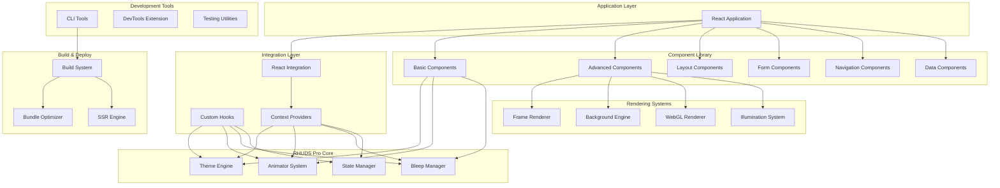
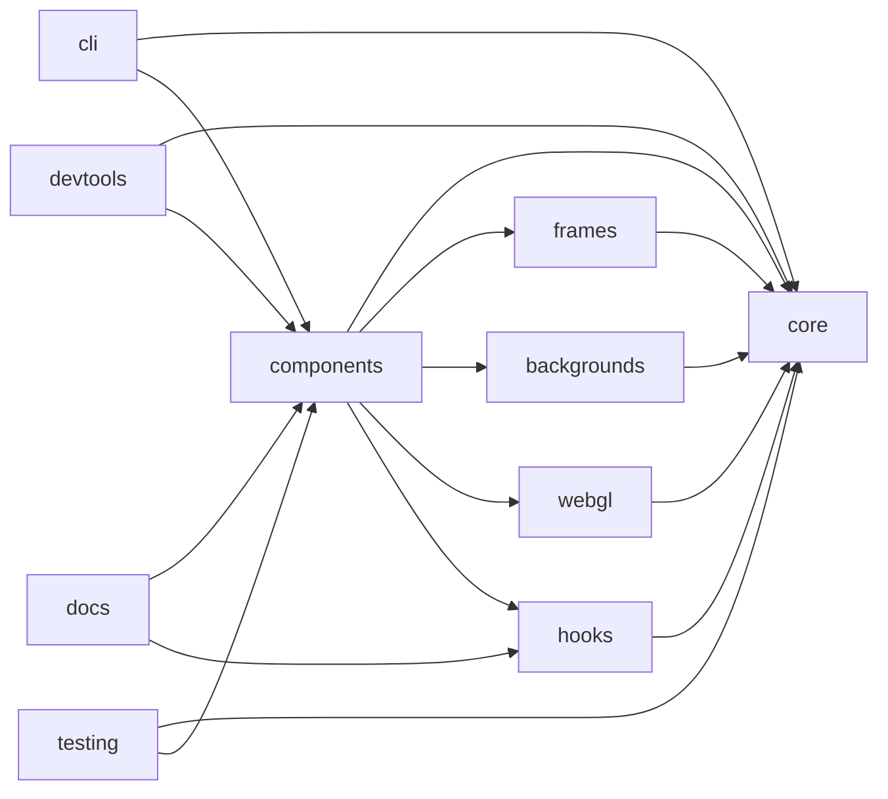
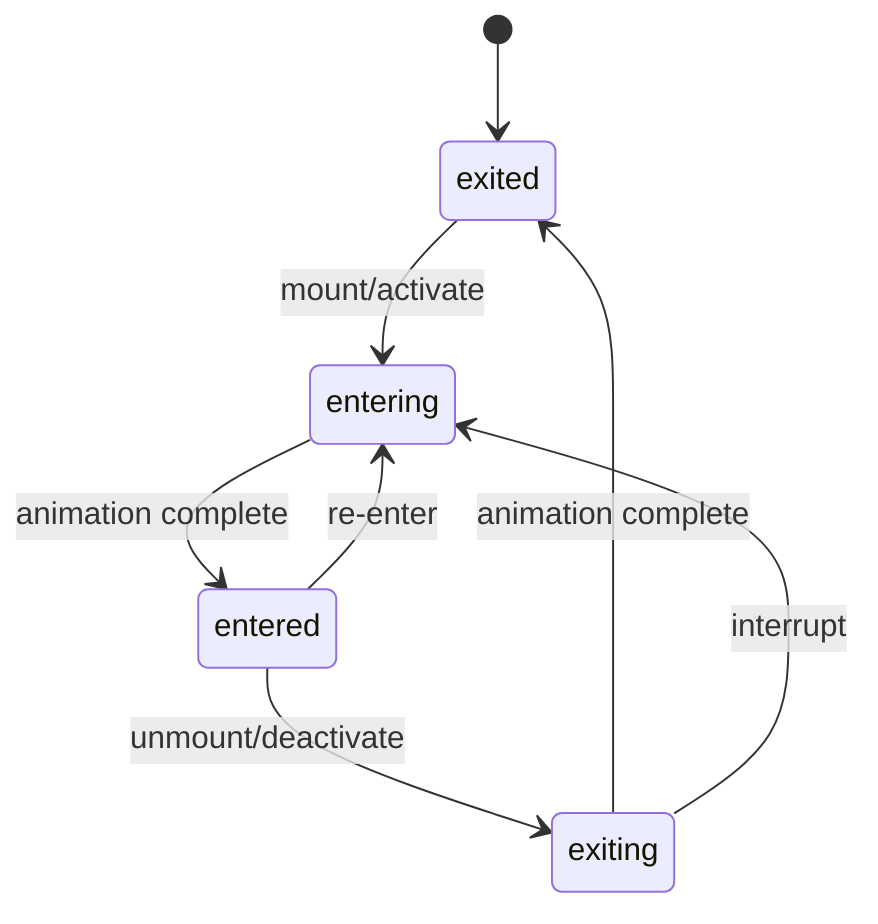

# RHUDS Pro - Technical Design Document

## Overview

RHUDS Pro is an enterprise-grade, futuristic UI design system that extends beyond traditional component libraries to provide a comprehensive suite of visual, motion, and audio design tools. Built for creating immersive, sci-fi themed user interfaces, it combines advanced animations, 3D effects, spatial audio, and extensive accessibility support into a cohesive, performant system.

### System Goals

- Provide a complete design system for building futuristic, sci-fi themed interfaces
- Deliver enterprise-grade performance with 60fps animations and efficient rendering
- Ensure WCAG 2.1 AA accessibility compliance across all components
- Support modern development workflows with TypeScript, React 18+, and property-based testing
- Enable immersive experiences through 3D graphics, spatial audio, and advanced animations
- Maintain developer productivity through comprehensive tooling, documentation, and testing utilities

### Key Differentiators

- **Integrated Audio System**: Built-in 3D spatial audio with effects pipeline
- **Advanced Animation Engine**: Physics-based, gesture-driven, and scroll-triggered animations
- **Futuristic Aesthetics**: SVG-based frames, illumination effects, and particle backgrounds
- **3D/WebGL Support**: Three.js integration with custom shader support
- **Property-Based Testing**: Correctness guarantees through automated property testing
- **Comprehensive Tooling**: CLI tools, DevTools extension, and migration utilities

## Architecture

### High-Level System Architecture



### Package Structure

```
rhuds-pro/
├── packages/
│   ├── core/                    # Core theme, animation, audio systems
│   │   ├── src/
│   │   │   ├── theme/          # Theme engine
│   │   │   ├── animation/      # Animator system
│   │   │   ├── audio/          # Bleep manager
│   │   │   ├── store/          # State management
│   │   │   └── utils/          # Shared utilities
│   │   └── package.json
│   │
│   ├── components/              # Component library
│   │   ├── src/
│   │   │   ├── basic/          # Text, Button, Icon
│   │   │   ├── layout/         # Grid, Container, Stack
│   │   │   ├── form/           # Input, Select, Checkbox
│   │   │   ├── navigation/     # Navbar, Sidebar, Tabs
│   │   │   ├── data/           # Table, DataGrid, Chart
│   │   │   ├── feedback/       # Modal, Toast, Alert
│   │   │   └── advanced/       # 3D, AR/VR components
│   │   └── package.json
│   │
│   ├── frames/                  # SVG frame system
│   │   ├── src/
│   │   │   ├── renderers/      # Frame rendering logic
│   │   │   ├── variants/       # Octagon, Kranox, etc.
│   │   │   └── clips/          # Clipping path generators
│   │   └── package.json
│   │
│   ├── backgrounds/             # Background effects
│   │   ├── src/
│   │   │   ├── dots/           # Dot patterns
│   │   │   ├── puffs/          # Particle effects
│   │   │   ├── lines/          # Grid and moving lines
│   │   │   └── advanced/       # Nebula, starfield
│   │   └── package.json
│   │
│   ├── webgl/                   # WebGL and 3D
│   │   ├── src/
│   │   │   ├── three/          # Three.js wrappers
│   │   │   ├── shaders/        # Custom shaders
│   │   │   └── effects/        # Post-processing
│   │   └── package.json
│   │
│   ├── hooks/                   # Custom React hooks
│   │   ├── src/
│   │   │   ├── theme/          # useTheme, useBreakpoint
│   │   │   ├── animation/      # useAnimator
│   │   │   ├── audio/          # useBleeps
│   │   │   └── utils/          # useDebounce, useThrottle
│   │   └── package.json
│   │
│   ├── cli/                     # CLI tools
│   │   ├── src/
│   │   │   ├── commands/       # Scaffold, generate, migrate
│   │   │   ├── templates/      # Project templates
│   │   │   └── utils/          # CLI utilities
│   │   └── package.json
│   │
│   ├── devtools/                # Browser DevTools extension
│   │   ├── src/
│   │   │   ├── panel/          # DevTools panel UI
│   │   │   ├── inspector/      # Component inspector
│   │   │   └── profiler/       # Performance profiler
│   │   └── package.json
│   │
│   ├── testing/                 # Testing utilities
│   │   ├── src/
│   │   │   ├── mocks/          # Mock providers
│   │   │   ├── utils/          # Test helpers
│   │   │   └── generators/     # Property test generators
│   │   └── package.json
│   │
│   └── docs/                    # Documentation site
│       ├── src/
│       │   ├── pages/          # Documentation pages
│       │   ├── examples/       # Code examples
│       │   └── components/     # Doc site components
│       └── package.json
│
├── apps/
│   ├── storybook/              # Storybook for component development
│   └── playground/             # Interactive playground
│
├── turbo.json                  # Turborepo configuration
├── package.json                # Root package.json
└── tsconfig.json               # Root TypeScript config
```

### Module Dependencies



### Build and Deployment Architecture

- **Build Tool**: Vite for fast development and optimized production builds
- **Monorepo Manager**: Turborepo for efficient task orchestration and caching
- **Package Manager**: pnpm for efficient dependency management
- **Bundler**: Rollup for library builds with tree-shaking
- **TypeScript**: Strict mode with project references for type checking
- **Testing**: Vitest for unit tests, fast-check for property-based tests
- **Documentation**: Custom docs site built with Vite + React
- **Storybook**: Component development and documentation
- **CI/CD**: GitHub Actions for automated testing, building, and publishing

## Theme Engine Design

### Theme Object Structure

The theme system is built around a composable, type-safe theme object that defines all visual design tokens.

```typescript
interface RHUDSTheme {
  // Color system
  colors: {
    primary: ColorPalette;
    secondary: ColorPalette;
    success: ColorPalette;
    warning: ColorPalette;
    error: ColorPalette;
    info: ColorPalette;
    neutral: ColorPalette;
    background: ColorPalette;
    text: ColorPalette;
    custom?: Record<string, ColorPalette>;
  };
  
  // Unit system (spacing, sizing)
  units: {
    space: UnitScale;      // 0-10 scale for spacing
    size: UnitScale;       // 0-10 scale for sizing
    radius: UnitScale;     // Border radius scale
    shadow: ShadowScale;   // Shadow definitions
  };
  
  // Typography system
  typography: {
    fontFamily: {
      primary: string;
      secondary: string;
      mono: string;
    };
    fontSize: FontSizeScale;
    fontWeight: FontWeightScale;
    lineHeight: LineHeightScale;
    letterSpacing: LetterSpacingScale;
  };
  
  // Breakpoint system
  breakpoints: {
    values: BreakpointValues;
    labels: BreakpointLabels;
  };
  
  // Animation defaults
  animation: {
    duration: DurationScale;
    easing: EasingFunctions;
  };
  
  // Z-index system
  zIndex: {
    dropdown: number;
    modal: number;
    popover: number;
    tooltip: number;
    notification: number;
  };
}

interface ColorPalette {
  main: string;
  light: string;
  dark: string;
  contrast: string;
  alpha: (opacity: number) => string;
  gradient?: GradientDefinition;
}

interface UnitScale {
  0: number;
  1: number;
  2: number;
  3: number;
  4: number;
  5: number;
  6: number;
  7: number;
  8: number;
  9: number;
  10: number;
}

interface GradientDefinition {
  type: 'linear' | 'radial' | 'conic';
  angle?: number;
  stops: Array<{ color: string; position: number }>;
}
```

### Color System Architecture

The color system provides advanced color manipulation and accessibility features:

```typescript
class ColorSystem {
  // Color generation
  generatePalette(baseColor: string): ColorPalette;
  generateVariations(color: string, options: VariationOptions): string[];
  
  // Color manipulation
  lighten(color: string, amount: number): string;
  darken(color: string, amount: number): string;
  saturate(color: string, amount: number): string;
  desaturate(color: string, amount: number): string;
  alpha(color: string, opacity: number): string;
  
  // Color conversion
  toRGB(color: string): RGB;
  toHSL(color: string): HSL;
  toHex(color: string): string;
  
  // Accessibility
  getContrastRatio(color1: string, color2: string): number;
  meetsWCAG(color1: string, color2: string, level: 'AA' | 'AAA'): boolean;
  findAccessibleColor(baseColor: string, background: string): string;
  
  // Gradients
  createGradient(definition: GradientDefinition): string;
  animateGradient(from: GradientDefinition, to: GradientDefinition): Animation;
}
```

### Theme Composition and Inheritance

Themes support composition and inheritance for creating theme variants:

```typescript
// Base theme
const baseTheme = createTheme({
  colors: { /* ... */ },
  units: { /* ... */ },
  typography: { /* ... */ },
});

// Extended theme (inherits from base)
const darkTheme = createTheme({
  ...baseTheme,
  colors: {
    ...baseTheme.colors,
    background: {
      main: '#0a0a0a',
      light: '#1a1a1a',
      dark: '#000000',
      contrast: '#ffffff',
    },
  },
});

// Composed theme (merges multiple themes)
const customTheme = composeThemes(baseTheme, {
  colors: customColors,
  units: customUnits,
});
```

### Theme Serialization Format

Themes can be serialized to JSON for storage and sharing:

```json
{
  "name": "RHUDS Dark",
  "version": "1.0.0",
  "colors": {
    "primary": {
      "main": "#00f6ff",
      "light": "#66f9ff",
      "dark": "#00c4cc",
      "contrast": "#000000"
    }
  },
  "units": {
    "space": {
      "0": 0,
      "1": 4,
      "2": 8,
      "3": 12,
      "4": 16,
      "5": 24,
      "6": 32,
      "7": 48,
      "8": 64,
      "9": 96,
      "10": 128
    }
  }
}
```

## Animator System Design

### Animation Engine Architecture

The Animator system provides a declarative, lifecycle-based animation framework:



### Animator Component Lifecycle

```typescript
interface AnimatorProps {
  // Lifecycle control
  activate?: boolean;
  duration?: AnimationDuration;
  initialState?: 'entered' | 'exited';
  unmountOnExited?: boolean;
  
  // Animation configuration
  animator?: AnimatorSettings;
  
  // Callbacks
  onAnimateEntering?: () => void;
  onAnimateEntered?: () => void;
  onAnimateExiting?: () => void;
  onAnimateExited?: () => void;
  
  // Children
  children?: React.ReactNode | ((animator: AnimatorControl) => React.ReactNode);
}

interface AnimatorSettings {
  duration?: {
    enter?: number;
    exit?: number;
    stagger?: number;
    delay?: number;
  };
  easing?: {
    enter?: EasingFunction;
    exit?: EasingFunction;
  };
  initialState?: 'entered' | 'exited';
  unmountOnExited?: boolean;
}

interface AnimatorControl {
  flow: AnimatorFlow;
  duration: AnimationDuration;
  animate(state: AnimatorState): void;
}

type AnimatorFlow = {
  value: 'entering' | 'entered' | 'exiting' | 'exited';
  entering: boolean;
  entered: boolean;
  exiting: boolean;
  exited: boolean;
  transitioning: boolean;
};
```

### Animation Managers

#### Stagger Manager

Staggers child animations with configurable delays:

```typescript
interface StaggerProps {
  stagger?: number | 'auto';
  direction?: 'forward' | 'reverse';
  children: React.ReactNode[];
}

// Usage
<Stagger stagger={50}>
  {items.map(item => (
    <Animator key={item.id}>
      <Item data={item} />
    </Animator>
  ))}
</Stagger>
```

#### Sequence Manager

Runs animations in sequence:

```typescript
interface SequenceProps {
  children: React.ReactNode[];
  onComplete?: () => void;
}

// Usage
<Sequence>
  <Animator duration={300}><Step1 /></Animator>
  <Animator duration={500}><Step2 /></Animator>
  <Animator duration={200}><Step3 /></Animator>
</Sequence>
```

#### Switch Manager

Conditionally switches between animated components:

```typescript
interface SwitchProps {
  condition: boolean;
  children: [React.ReactNode, React.ReactNode];
}

// Usage
<Switch condition={isLoggedIn}>
  <Animator><LoginForm /></Animator>
  <Animator><Dashboard /></Animator>
</Switch>
```

### Physics-Based Animation System

Physics-based animations use spring dynamics for natural motion:

```typescript
interface SpringConfig {
  mass?: number;        // Default: 1
  tension?: number;     // Default: 170
  friction?: number;    // Default: 26
  velocity?: number;    // Default: 0
  clamp?: boolean;      // Default: false
}

interface PhysicsAnimator {
  spring(from: number, to: number, config: SpringConfig): Animation;
  decay(velocity: number, config: DecayConfig): Animation;
  inertia(velocity: number, bounds: [number, number]): Animation;
}

// Usage
const animation = useSpring({
  from: { opacity: 0, y: -20 },
  to: { opacity: 1, y: 0 },
  config: { tension: 280, friction: 60 },
});
```

### Gesture Animation System

Gesture-driven animations respond to user input:

```typescript
interface GestureConfig {
  drag?: DragConfig;
  swipe?: SwipeConfig;
  pinch?: PinchConfig;
  rotate?: RotateConfig;
}

interface DragConfig {
  axis?: 'x' | 'y' | 'both';
  bounds?: { left?: number; right?: number; top?: number; bottom?: number };
  elastic?: boolean;
  onDrag?: (state: DragState) => void;
  onDragEnd?: (state: DragState) => void;
}

// Usage
const bind = useGesture({
  drag: ({ offset: [x, y] }) => {
    api.start({ x, y });
  },
  swipe: ({ direction: [dx, dy] }) => {
    if (dx > 0) handleSwipeRight();
  },
});

<div {...bind()} />
```

### Scroll-Triggered Animation System

Animations triggered by scroll position:

```typescript
interface ScrollAnimationConfig {
  trigger: 'enter' | 'exit' | 'progress';
  threshold?: number | number[];
  rootMargin?: string;
  once?: boolean;
  onEnter?: () => void;
  onExit?: () => void;
  onProgress?: (progress: number) => void;
}

// Usage
const { ref, progress } = useScrollAnimation({
  trigger: 'progress',
  onProgress: (p) => {
    api.start({ opacity: p, scale: 0.8 + p * 0.2 });
  },
});

<div ref={ref}>Content</div>
```

## Audio System Design

### Bleep Manager Architecture

The audio system manages sound effects with spatial audio and effects processing:

```typescript
interface BleepManager {
  // Bleep management
  create(id: string, config: BleepConfig): Bleep;
  get(id: string): Bleep | undefined;
  remove(id: string): void;
  
  // Playback control
  play(id: string, options?: PlayOptions): void;
  stop(id: string): void;
  pause(id: string): void;
  resume(id: string): void;
  
  // Global controls
  setMasterVolume(volume: number): void;
  setCategoryVolume(category: string, volume: number): void;
  mute(muted: boolean): void;
  
  // Preloading
  preload(ids: string[]): Promise<void>;
  preloadAll(): Promise<void>;
}

interface BleepConfig {
  sources: AudioSource[];
  category?: string;
  volume?: number;
  loop?: boolean;
  loopStart?: number;
  loopEnd?: number;
  playbackRate?: number;
  spatial?: SpatialConfig;
  effects?: AudioEffect[];
}

interface AudioSource {
  src: string;
  format: 'mp3' | 'ogg' | 'wav' | 'webm';
}
```

### 3D Spatial Audio System

Spatial audio provides positional sound in 3D space:

```typescript
interface SpatialConfig {
  position: [number, number, number];
  orientation?: [number, number, number];
  refDistance?: number;
  maxDistance?: number;
  rolloffFactor?: number;
  coneInnerAngle?: number;
  coneOuterAngle?: number;
  coneOuterGain?: number;
}

interface SpatialAudioEngine {
  // Listener (camera) control
  setListenerPosition(x: number, y: number, z: number): void;
  setListenerOrientation(forward: Vector3, up: Vector3): void;
  
  // Source control
  updateSourcePosition(bleepId: string, x: number, y: number, z: number): void;
  updateSourceOrientation(bleepId: string, x: number, y: number, z: number): void;
  
  // Distance model
  setDistanceModel(model: 'linear' | 'inverse' | 'exponential'): void;
}
```

### Audio Effects Pipeline

Audio effects can be chained for complex sound design:

```typescript
interface AudioEffect {
  type: 'reverb' | 'delay' | 'distortion' | 'filter' | 'compressor' | 'eq';
  params: EffectParams;
}

interface ReverbParams {
  decay: number;
  preDelay: number;
  wetDry: number;
}

interface DelayParams {
  time: number;
  feedback: number;
  wetDry: number;
}

interface FilterParams {
  type: 'lowpass' | 'highpass' | 'bandpass' | 'notch';
  frequency: number;
  Q: number;
  gain?: number;
}

// Usage
const bleep = bleepManager.create('laser', {
  sources: [{ src: '/sounds/laser.mp3', format: 'mp3' }],
  effects: [
    { type: 'filter', params: { type: 'lowpass', frequency: 2000, Q: 1 } },
    { type: 'reverb', params: { decay: 2, preDelay: 0.01, wetDry: 0.3 } },
  ],
});
```

### Audio Visualization System

Real-time audio analysis for visualizations:

```typescript
interface AudioVisualizer {
  // Frequency analysis
  getFrequencyData(): Uint8Array;
  getFrequencyBands(bands: number): number[];
  
  // Waveform analysis
  getWaveformData(): Float32Array;
  
  // Audio features
  getVolume(): number;
  getBass(): number;
  getMid(): number;
  getTreble(): number;
  
  // Beat detection
  detectBeat(threshold?: number): boolean;
  getBPM(): number;
}

// Usage
const visualizer = useBleepVisualizer('background-music');
const frequencyData = visualizer.getFrequencyData();

// Render visualization
<Canvas>
  {frequencyData.map((value, i) => (
    <Bar key={i} height={value} />
  ))}
</Canvas>
```


## Component Library Architecture

### Component Base Classes

All components extend from base classes that provide common functionality:

```typescript
interface BaseComponentProps {
  className?: string;
  style?: React.CSSProperties;
  id?: string;
  'data-testid'?: string;
  
  // Theme integration
  theme?: Partial<RHUDSTheme>;
  
  // Animation integration
  animator?: AnimatorSettings;
  
  // Audio integration
  bleeps?: BleepBindings;
  
  // Accessibility
  'aria-label'?: string;
  'aria-describedby'?: string;
  role?: string;
}

interface BleepBindings {
  hover?: string;
  click?: string;
  focus?: string;
  enter?: string;
  exit?: string;
}

// Base component implementation
abstract class RHUDSComponent<P extends BaseComponentProps> extends React.Component<P> {
  protected theme: RHUDSTheme;
  protected animator?: AnimatorControl;
  protected bleeps?: BleepManager;
  
  // Lifecycle hooks
  protected onMount(): void {}
  protected onUnmount(): void {}
  protected onUpdate(prevProps: P): void {}
  
  // Utility methods
  protected getClassName(...classes: string[]): string;
  protected playBleep(event: string): void;
  protected animate(state: AnimatorState): void;
}
```

### Component Composition Patterns

Components use composition for flexibility:

```typescript
// Compound component pattern
<Card>
  <Card.Header>
    <Card.Title>Title</Card.Title>
    <Card.Subtitle>Subtitle</Card.Subtitle>
  </Card.Header>
  <Card.Body>
    Content
  </Card.Body>
  <Card.Footer>
    <Button>Action</Button>
  </Card.Footer>
</Card>

// Slot pattern
<Dialog>
  <Dialog.Trigger>
    <Button>Open</Button>
  </Dialog.Trigger>
  <Dialog.Content>
    <Dialog.Title>Title</Dialog.Title>
    <Dialog.Description>Description</Dialog.Description>
    <Dialog.Actions>
      <Button>Cancel</Button>
      <Button>Confirm</Button>
    </Dialog.Actions>
  </Dialog.Content>
</Dialog>

// Render prop pattern
<DataGrid data={data}>
  {({ row, column }) => (
    <Cell>{formatValue(row[column.key])}</Cell>
  )}
</DataGrid>
```

### Styling System

Components use a CSS-in-JS solution with theme integration:

```typescript
interface StyleFunction<P = {}> {
  (props: P & { theme: RHUDSTheme }): CSSObject;
}

// Styled component creation
const StyledButton = styled('button')<ButtonProps>(({ theme, variant, size }) => ({
  // Base styles
  fontFamily: theme.typography.fontFamily.primary,
  fontSize: theme.typography.fontSize[size],
  padding: `${theme.units.space[2]}px ${theme.units.space[4]}px`,
  borderRadius: theme.units.radius[1],
  
  // Variant styles
  backgroundColor: theme.colors[variant].main,
  color: theme.colors[variant].contrast,
  
  // Interactive states
  '&:hover': {
    backgroundColor: theme.colors[variant].light,
  },
  '&:active': {
    backgroundColor: theme.colors[variant].dark,
  },
  '&:focus-visible': {
    outline: `2px solid ${theme.colors[variant].main}`,
    outlineOffset: 2,
  },
  
  // Transitions
  transition: `all ${theme.animation.duration.short}ms ${theme.animation.easing.standard}`,
}));
```

### Animation Integration

Components integrate animations through the Animator system:

```typescript
const AnimatedCard: React.FC<CardProps> = ({ children, ...props }) => {
  return (
    <Animator
      duration={{ enter: 300, exit: 200 }}
      initialState="exited"
    >
      {({ flow }) => (
        <StyledCard
          style={{
            opacity: flow.entered ? 1 : 0,
            transform: flow.entered ? 'translateY(0)' : 'translateY(-20px)',
          }}
          {...props}
        >
          {children}
        </StyledCard>
      )}
    </Animator>
  );
};
```

### Audio Integration

Components can trigger sound effects on interactions:

```typescript
const Button: React.FC<ButtonProps> = ({ onClick, bleeps, ...props }) => {
  const { play } = useBleeps();
  
  const handleClick = (e: React.MouseEvent) => {
    if (bleeps?.click) {
      play(bleeps.click);
    }
    onClick?.(e);
  };
  
  return (
    <StyledButton
      onClick={handleClick}
      onMouseEnter={() => bleeps?.hover && play(bleeps.hover)}
      {...props}
    />
  );
};
```

## Frame System Design

### SVG Rendering Engine

The frame system generates SVG paths for futuristic UI borders:

```typescript
interface FrameRenderer {
  // Path generation
  generatePath(config: FrameConfig): string;
  generateClipPath(config: FrameConfig): string;
  
  // SVG commands
  moveTo(x: number, y: number): string;
  lineTo(x: number, y: number): string;
  arcTo(rx: number, ry: number, angle: number, largeArc: boolean, sweep: boolean, x: number, y: number): string;
  quadraticCurveTo(cpx: number, cpy: number, x: number, y: number): string;
  
  // Utilities
  closePath(): string;
  combineCommands(...commands: string[]): string;
}

interface FrameConfig {
  width: number;
  height: number;
  cornerSize?: number;
  lineLength?: number;
  squareSize?: number;
  strokeWidth?: number;
  variant: 'octagon' | 'kranox' | 'nefrex' | 'corners' | 'lines' | 'underline';
}
```

### Frame Variants Architecture

Each frame variant implements a specific drawing algorithm:

```typescript
// Octagon frame
interface OctagonFrameConfig extends FrameConfig {
  variant: 'octagon';
  cornerSize: number;  // Size of corner cuts
}

// Kranox frame (complex assembly)
interface KranoxFrameConfig extends FrameConfig {
  variant: 'kranox';
  lineLength: number;
  squareSize: number;
  inverted?: boolean;
}

// Corners-only frame
interface CornersFrameConfig extends FrameConfig {
  variant: 'corners';
  cornerLength: number;
  cornerPosition: 'inside' | 'outside';
}

// Lines frame (dashed borders)
interface LinesFrameConfig extends FrameConfig {
  variant: 'lines';
  dashArray?: number[];
  dashOffset?: number;
}
```

### Clipping Path System

Clipping paths allow content to be masked by frame shapes:

```typescript
interface ClipPathGenerator {
  // Generate clip path ID
  generateId(prefix: string): string;
  
  // Create clip path element
  createClipPath(id: string, path: string): SVGClipPathElement;
  
  // Apply clip path to element
  applyClipPath(element: HTMLElement, clipPathId: string): void;
  
  // Remove clip path
  removeClipPath(element: HTMLElement): void;
}

// Usage
const FrameWithClip: React.FC = ({ children }) => {
  const clipId = useClipPathId('frame');
  
  return (
    <div>
      <svg width="0" height="0">
        <defs>
          <clipPath id={clipId}>
            <path d={generateOctagonPath()} />
          </clipPath>
        </defs>
      </svg>
      <div style={{ clipPath: `url(#${clipId})` }}>
        {children}
      </div>
    </div>
  );
};
```

## Background Engine Design

### Particle System Architecture

The particle system renders animated particles with physics:

```typescript
interface ParticleSystem {
  // Particle management
  createParticle(config: ParticleConfig): Particle;
  updateParticles(deltaTime: number): void;
  renderParticles(context: CanvasRenderingContext2D | WebGLRenderingContext): void;
  
  // Emitter control
  createEmitter(config: EmitterConfig): Emitter;
  startEmitter(id: string): void;
  stopEmitter(id: string): void;
  
  // Physics
  applyForce(force: Vector2): void;
  setGravity(gravity: Vector2): void;
  enableCollisions(enabled: boolean): void;
}

interface ParticleConfig {
  position: Vector2;
  velocity: Vector2;
  acceleration: Vector2;
  size: number;
  color: string;
  lifetime: number;
  mass?: number;
  drag?: number;
}

interface EmitterConfig {
  position: Vector2;
  rate: number;              // Particles per second
  lifetime: number;          // Emitter lifetime (-1 for infinite)
  particleConfig: Partial<ParticleConfig>;
  spread: number;            // Emission angle spread
  direction: Vector2;        // Base emission direction
}

interface Particle {
  position: Vector2;
  velocity: Vector2;
  acceleration: Vector2;
  size: number;
  color: string;
  age: number;
  lifetime: number;
  alive: boolean;
  
  update(deltaTime: number): void;
  render(context: CanvasRenderingContext2D): void;
}
```

### Canvas/WebGL Rendering

Background effects can use Canvas 2D or WebGL for rendering:

```typescript
interface BackgroundRenderer {
  // Initialization
  initialize(canvas: HTMLCanvasElement, useWebGL: boolean): void;
  
  // Rendering
  clear(): void;
  render(effects: BackgroundEffect[]): void;
  
  // Performance
  setTargetFPS(fps: number): void;
  enableAdaptiveQuality(enabled: boolean): void;
  
  // Utilities
  resize(width: number, height: number): void;
  destroy(): void;
}

// Canvas 2D renderer
class Canvas2DRenderer implements BackgroundRenderer {
  private ctx: CanvasRenderingContext2D;
  
  render(effects: BackgroundEffect[]): void {
    this.clear();
    for (const effect of effects) {
      effect.render(this.ctx);
    }
  }
}

// WebGL renderer (for complex effects)
class WebGLRenderer implements BackgroundRenderer {
  private gl: WebGLRenderingContext;
  private shaders: Map<string, WebGLProgram>;
  
  render(effects: BackgroundEffect[]): void {
    this.gl.clear(this.gl.COLOR_BUFFER_BIT);
    for (const effect of effects) {
      const shader = this.getShader(effect.type);
      effect.renderWebGL(this.gl, shader);
    }
  }
}
```

### Performance Optimization Strategies

Background effects use several optimization techniques:

1. **Object Pooling**: Reuse particle objects instead of creating new ones
2. **Spatial Partitioning**: Use quadtree for collision detection
3. **Level of Detail**: Reduce particle count based on performance
4. **Offscreen Culling**: Don't update particles outside viewport
5. **Adaptive Quality**: Automatically reduce quality if FPS drops
6. **Web Workers**: Move physics calculations to worker thread
7. **RequestAnimationFrame**: Sync with browser refresh rate

```typescript
class ParticlePool {
  private pool: Particle[] = [];
  private active: Set<Particle> = new Set();
  
  acquire(config: ParticleConfig): Particle {
    let particle = this.pool.pop();
    if (!particle) {
      particle = new Particle(config);
    } else {
      particle.reset(config);
    }
    this.active.add(particle);
    return particle;
  }
  
  release(particle: Particle): void {
    this.active.delete(particle);
    this.pool.push(particle);
  }
  
  update(deltaTime: number): void {
    for (const particle of this.active) {
      particle.update(deltaTime);
      if (!particle.alive) {
        this.release(particle);
      }
    }
  }
}
```

## 3D System Design (Three.js Integration)

### 3D Component Wrappers

React components wrap Three.js objects for declarative 3D:

```typescript
interface Scene3DProps {
  camera?: CameraConfig;
  lights?: LightConfig[];
  background?: string | THREE.Texture;
  fog?: FogConfig;
  children: React.ReactNode;
}

interface Mesh3DProps {
  geometry: GeometryConfig;
  material: MaterialConfig;
  position?: [number, number, number];
  rotation?: [number, number, number];
  scale?: [number, number, number];
  castShadow?: boolean;
  receiveShadow?: boolean;
  onClick?: (event: ThreeEvent) => void;
  onPointerOver?: (event: ThreeEvent) => void;
  onPointerOut?: (event: ThreeEvent) => void;
}

// Usage
<Scene3D camera={{ position: [0, 0, 5], fov: 75 }}>
  <AmbientLight intensity={0.5} />
  <DirectionalLight position={[10, 10, 5]} intensity={1} castShadow />
  
  <Mesh3D
    geometry={{ type: 'box', args: [1, 1, 1] }}
    material={{ type: 'standard', color: '#00f6ff', metalness: 0.8 }}
    position={[0, 0, 0]}
    onClick={(e) => console.log('Clicked!', e)}
  />
</Scene3D>
```

### WebGL Renderer Integration

The WebGL renderer manages Three.js rendering:

```typescript
interface WebGLRendererConfig {
  antialias?: boolean;
  alpha?: boolean;
  powerPreference?: 'high-performance' | 'low-power' | 'default';
  shadowMap?: {
    enabled: boolean;
    type: THREE.ShadowMapType;
  };
  toneMapping?: THREE.ToneMapping;
  toneMappingExposure?: number;
}

class RHUDSWebGLRenderer {
  private renderer: THREE.WebGLRenderer;
  private scene: THREE.Scene;
  private camera: THREE.Camera;
  private composer?: EffectComposer;
  
  constructor(canvas: HTMLCanvasElement, config: WebGLRendererConfig) {
    this.renderer = new THREE.WebGLRenderer({ canvas, ...config });
    this.setupPostProcessing();
  }
  
  render(): void {
    if (this.composer) {
      this.composer.render();
    } else {
      this.renderer.render(this.scene, this.camera);
    }
  }
  
  addPostProcessingPass(pass: Pass): void {
    this.composer?.addPass(pass);
  }
}
```

### Shader System Architecture

Custom shaders for unique visual effects:

```typescript
interface ShaderConfig {
  vertexShader: string;
  fragmentShader: string;
  uniforms: Record<string, THREE.IUniform>;
}

class ShaderManager {
  private shaders: Map<string, THREE.ShaderMaterial> = new Map();
  
  register(name: string, config: ShaderConfig): void {
    const material = new THREE.ShaderMaterial({
      vertexShader: config.vertexShader,
      fragmentShader: config.fragmentShader,
      uniforms: config.uniforms,
    });
    this.shaders.set(name, material);
  }
  
  get(name: string): THREE.ShaderMaterial | undefined {
    return this.shaders.get(name);
  }
  
  updateUniform(name: string, uniform: string, value: any): void {
    const shader = this.shaders.get(name);
    if (shader && shader.uniforms[uniform]) {
      shader.uniforms[uniform].value = value;
    }
  }
}

// Example: Hologram shader
const hologramShader: ShaderConfig = {
  vertexShader: `
    varying vec2 vUv;
    varying vec3 vNormal;
    
    void main() {
      vUv = uv;
      vNormal = normalize(normalMatrix * normal);
      gl_Position = projectionMatrix * modelViewMatrix * vec4(position, 1.0);
    }
  `,
  fragmentShader: `
    uniform float time;
    uniform vec3 color;
    varying vec2 vUv;
    varying vec3 vNormal;
    
    void main() {
      float scanline = sin(vUv.y * 100.0 + time * 5.0) * 0.5 + 0.5;
      float fresnel = pow(1.0 - dot(vNormal, vec3(0.0, 0.0, 1.0)), 2.0);
      vec3 finalColor = color * (scanline * 0.3 + 0.7) * (fresnel * 0.5 + 0.5);
      gl_FragColor = vec4(finalColor, 0.8);
    }
  `,
  uniforms: {
    time: { value: 0 },
    color: { value: new THREE.Color(0x00f6ff) },
  },
};
```

## State Management Design

### Redux Store Structure

The state management system uses Redux Toolkit:

```typescript
interface RootState {
  theme: ThemeState;
  ui: UIState;
  audio: AudioState;
  animation: AnimationState;
  user: UserState;
  data: DataState;
}

interface ThemeState {
  current: string;
  themes: Record<string, RHUDSTheme>;
  customizations: ThemeCustomization[];
}

interface UIState {
  modals: ModalState[];
  notifications: Notification[];
  loading: LoadingState;
  errors: ErrorState[];
}

interface AudioState {
  masterVolume: number;
  categoryVolumes: Record<string, number>;
  muted: boolean;
  bleeps: Record<string, BleepState>;
}

interface AnimationState {
  globalDuration: number;
  reducedMotion: boolean;
  activeAnimations: string[];
}
```

### State Slices Organization

Each domain has its own slice:

```typescript
// Theme slice
const themeSlice = createSlice({
  name: 'theme',
  initialState: initialThemeState,
  reducers: {
    setTheme: (state, action: PayloadAction<string>) => {
      state.current = action.payload;
    },
    addTheme: (state, action: PayloadAction<{ name: string; theme: RHUDSTheme }>) => {
      state.themes[action.payload.name] = action.payload.theme;
    },
    updateTheme: (state, action: PayloadAction<{ name: string; updates: Partial<RHUDSTheme> }>) => {
      const theme = state.themes[action.payload.name];
      if (theme) {
        Object.assign(theme, action.payload.updates);
      }
    },
  },
});

// UI slice
const uiSlice = createSlice({
  name: 'ui',
  initialState: initialUIState,
  reducers: {
    openModal: (state, action: PayloadAction<ModalConfig>) => {
      state.modals.push({ ...action.payload, id: generateId() });
    },
    closeModal: (state, action: PayloadAction<string>) => {
      state.modals = state.modals.filter(m => m.id !== action.payload);
    },
    showNotification: (state, action: PayloadAction<NotificationConfig>) => {
      state.notifications.push({ ...action.payload, id: generateId(), timestamp: Date.now() });
    },
  },
});
```

### Middleware Architecture

Custom middleware for side effects:

```typescript
// Audio middleware - plays sounds on actions
const audioMiddleware: Middleware = (store) => (next) => (action) => {
  const result = next(action);
  
  // Play sound effects based on action type
  const bleepBindings: Record<string, string> = {
    'ui/openModal': 'modal-open',
    'ui/closeModal': 'modal-close',
    'ui/showNotification': 'notification',
    'theme/setTheme': 'theme-change',
  };
  
  const bleepId = bleepBindings[action.type];
  if (bleepId) {
    store.dispatch(playBleep(bleepId));
  }
  
  return result;
};

// Analytics middleware - tracks user actions
const analyticsMiddleware: Middleware = (store) => (next) => (action) => {
  const result = next(action);
  
  if (action.type.startsWith('user/')) {
    trackEvent({
      category: 'User Action',
      action: action.type,
      label: JSON.stringify(action.payload),
    });
  }
  
  return result;
};

// Persistence middleware - saves state to localStorage
const persistenceMiddleware: Middleware = (store) => (next) => (action) => {
  const result = next(action);
  
  const stateToPersist = {
    theme: store.getState().theme.current,
    audio: {
      masterVolume: store.getState().audio.masterVolume,
      muted: store.getState().audio.muted,
    },
  };
  
  localStorage.setItem('rhuds-state', JSON.stringify(stateToPersist));
  
  return result;
};
```


## Accessibility System Design

### ARIA Integration

All components implement proper ARIA attributes:

```typescript
interface AccessibilityProps {
  // ARIA labels
  'aria-label'?: string;
  'aria-labelledby'?: string;
  'aria-describedby'?: string;
  
  // ARIA states
  'aria-expanded'?: boolean;
  'aria-selected'?: boolean;
  'aria-checked'?: boolean;
  'aria-disabled'?: boolean;
  'aria-hidden'?: boolean;
  
  // ARIA properties
  'aria-haspopup'?: boolean | 'menu' | 'listbox' | 'tree' | 'grid' | 'dialog';
  'aria-controls'?: string;
  'aria-owns'?: string;
  
  // Live regions
  'aria-live'?: 'off' | 'polite' | 'assertive';
  'aria-atomic'?: boolean;
  'aria-relevant'?: string;
}

class AccessibilityManager {
  // Generate unique IDs for ARIA relationships
  generateId(prefix: string): string;
  
  // Announce to screen readers
  announce(message: string, priority: 'polite' | 'assertive'): void;
  
  // Validate ARIA usage
  validateARIA(element: HTMLElement): ValidationResult[];
  
  // Check color contrast
  checkContrast(foreground: string, background: string): ContrastResult;
}
```

### Focus Management System

Comprehensive focus management for keyboard navigation:

```typescript
interface FocusManager {
  // Focus trap for modals/dialogs
  trapFocus(container: HTMLElement): FocusTrap;
  releaseFocus(trap: FocusTrap): void;
  
  // Focus restoration
  saveFocus(): FocusState;
  restoreFocus(state: FocusState): void;
  
  // Focus navigation
  focusFirst(container: HTMLElement): void;
  focusLast(container: HTMLElement): void;
  focusNext(current: HTMLElement): void;
  focusPrevious(current: HTMLElement): void;
  
  // Focus visibility
  setFocusVisible(visible: boolean): void;
  isFocusVisible(): boolean;
}

interface FocusTrap {
  activate(): void;
  deactivate(): void;
  pause(): void;
  unpause(): void;
}

// Usage in Modal component
const Modal: React.FC<ModalProps> = ({ isOpen, onClose, children }) => {
  const modalRef = useRef<HTMLDivElement>(null);
  const previousFocus = useRef<FocusState>();
  
  useEffect(() => {
    if (isOpen && modalRef.current) {
      previousFocus.current = focusManager.saveFocus();
      const trap = focusManager.trapFocus(modalRef.current);
      
      return () => {
        trap.deactivate();
        if (previousFocus.current) {
          focusManager.restoreFocus(previousFocus.current);
        }
      };
    }
  }, [isOpen]);
  
  return isOpen ? (
    <div ref={modalRef} role="dialog" aria-modal="true">
      {children}
    </div>
  ) : null;
};
```

### Screen Reader Support

Components provide meaningful screen reader experiences:

```typescript
interface ScreenReaderSupport {
  // Live region announcements
  announcePolite(message: string): void;
  announceAssertive(message: string): void;
  
  // Status updates
  announceStatus(status: string): void;
  announceError(error: string): void;
  announceSuccess(message: string): void;
  
  // Progress updates
  announceProgress(current: number, total: number): void;
  announceLoading(isLoading: boolean): void;
}

// Live region component
const LiveRegion: React.FC<{ message: string; priority: 'polite' | 'assertive' }> = ({ message, priority }) => {
  return (
    <div
      role="status"
      aria-live={priority}
      aria-atomic="true"
      style={{
        position: 'absolute',
        left: '-10000px',
        width: '1px',
        height: '1px',
        overflow: 'hidden',
      }}
    >
      {message}
    </div>
  );
};

// Usage in data loading
const DataTable: React.FC<DataTableProps> = ({ data, loading }) => {
  const [announcement, setAnnouncement] = useState('');
  
  useEffect(() => {
    if (loading) {
      setAnnouncement('Loading data...');
    } else {
      setAnnouncement(`Loaded ${data.length} rows`);
    }
  }, [loading, data.length]);
  
  return (
    <>
      <LiveRegion message={announcement} priority="polite" />
      <table>{/* table content */}</table>
    </>
  );
};
```

## Performance Monitoring Design

### Metrics Collection System

Comprehensive performance tracking:

```typescript
interface PerformanceMonitor {
  // Component metrics
  trackComponentRender(componentName: string, duration: number): void;
  trackComponentMount(componentName: string, duration: number): void;
  trackComponentUpdate(componentName: string, duration: number): void;
  
  // Animation metrics
  trackAnimationFrame(frameTime: number): void;
  trackAnimationDuration(animationId: string, duration: number): void;
  
  // Memory metrics
  trackMemoryUsage(): MemoryMetrics;
  
  // Network metrics
  trackNetworkRequest(url: string, duration: number, size: number): void;
  
  // Core Web Vitals
  trackLCP(value: number): void;
  trackFID(value: number): void;
  trackCLS(value: number): void;
  trackTTFB(value: number): void;
  
  // Custom metrics
  trackCustomMetric(name: string, value: number, tags?: Record<string, string>): void;
  
  // Reporting
  getMetrics(): PerformanceMetrics;
  exportMetrics(): string;
  clearMetrics(): void;
}

interface PerformanceMetrics {
  components: ComponentMetrics[];
  animations: AnimationMetrics;
  memory: MemoryMetrics;
  network: NetworkMetrics;
  webVitals: WebVitalsMetrics;
  custom: CustomMetrics[];
}

interface ComponentMetrics {
  name: string;
  renderCount: number;
  averageRenderTime: number;
  maxRenderTime: number;
  totalRenderTime: number;
}
```

### Performance Budgets

Enforce performance budgets to prevent regressions:

```typescript
interface PerformanceBudget {
  // Bundle size budgets (in KB)
  bundles: {
    main: number;
    vendor: number;
    total: number;
  };
  
  // Render time budgets (in ms)
  renderTime: {
    initial: number;
    update: number;
  };
  
  // Animation budgets
  animation: {
    fps: number;           // Minimum FPS
    frameTime: number;     // Maximum frame time in ms
  };
  
  // Memory budgets (in MB)
  memory: {
    heap: number;
    total: number;
  };
  
  // Core Web Vitals budgets
  webVitals: {
    lcp: number;          // Largest Contentful Paint (ms)
    fid: number;          // First Input Delay (ms)
    cls: number;          // Cumulative Layout Shift
    ttfb: number;         // Time to First Byte (ms)
  };
}

class BudgetEnforcer {
  private budget: PerformanceBudget;
  private violations: BudgetViolation[] = [];
  
  check(metrics: PerformanceMetrics): BudgetViolation[] {
    this.violations = [];
    
    // Check bundle sizes
    if (metrics.bundles.total > this.budget.bundles.total) {
      this.violations.push({
        type: 'bundle-size',
        metric: 'total',
        actual: metrics.bundles.total,
        budget: this.budget.bundles.total,
        severity: 'error',
      });
    }
    
    // Check render times
    if (metrics.components.some(c => c.averageRenderTime > this.budget.renderTime.update)) {
      this.violations.push({
        type: 'render-time',
        metric: 'component-update',
        actual: Math.max(...metrics.components.map(c => c.averageRenderTime)),
        budget: this.budget.renderTime.update,
        severity: 'warning',
      });
    }
    
    // Check animation performance
    if (metrics.animations.averageFPS < this.budget.animation.fps) {
      this.violations.push({
        type: 'animation',
        metric: 'fps',
        actual: metrics.animations.averageFPS,
        budget: this.budget.animation.fps,
        severity: 'error',
      });
    }
    
    // Check Core Web Vitals
    if (metrics.webVitals.lcp > this.budget.webVitals.lcp) {
      this.violations.push({
        type: 'web-vitals',
        metric: 'lcp',
        actual: metrics.webVitals.lcp,
        budget: this.budget.webVitals.lcp,
        severity: 'warning',
      });
    }
    
    return this.violations;
  }
  
  report(): string {
    if (this.violations.length === 0) {
      return 'All performance budgets met ✓';
    }
    
    return this.violations
      .map(v => `[${v.severity.toUpperCase()}] ${v.type}/${v.metric}: ${v.actual} exceeds budget of ${v.budget}`)
      .join('\n');
  }
}
```

### Profiling Tools

Development tools for performance analysis:

```typescript
interface Profiler {
  // Start profiling session
  start(sessionName: string): void;
  
  // Stop profiling session
  stop(): ProfileSession;
  
  // Mark events
  mark(eventName: string): void;
  measure(measureName: string, startMark: string, endMark: string): void;
  
  // Component profiling
  profileComponent<T>(componentName: string, fn: () => T): T;
  
  // Async profiling
  profileAsync<T>(operationName: string, fn: () => Promise<T>): Promise<T>;
}

// Usage with React Profiler
const ProfiledComponent: React.FC = () => {
  return (
    <Profiler
      id="MyComponent"
      onRender={(id, phase, actualDuration) => {
        performanceMonitor.trackComponentRender(id, actualDuration);
      }}
    >
      <MyComponent />
    </Profiler>
  );
};

// Usage with custom profiler
const result = await profiler.profileAsync('data-fetch', async () => {
  const data = await fetchData();
  return processData(data);
});
```

## CLI Tools Design

### Command Structure

The CLI provides commands for common development tasks:

```typescript
interface CLICommand {
  name: string;
  description: string;
  options: CLIOption[];
  action: (args: any) => Promise<void>;
}

// Available commands
const commands: CLICommand[] = [
  {
    name: 'init',
    description: 'Initialize a new RHUDS Pro project',
    options: [
      { name: 'template', type: 'string', description: 'Project template to use' },
      { name: 'typescript', type: 'boolean', description: 'Use TypeScript' },
    ],
    action: initProject,
  },
  {
    name: 'generate',
    description: 'Generate components, themes, or other assets',
    options: [
      { name: 'type', type: 'string', required: true, choices: ['component', 'theme', 'hook'] },
      { name: 'name', type: 'string', required: true },
    ],
    action: generateAsset,
  },
  {
    name: 'migrate',
    description: 'Migrate from another design system',
    options: [
      { name: 'from', type: 'string', required: true, choices: ['mui', 'antd', 'chakra', 'arwes'] },
      { name: 'dry-run', type: 'boolean', description: 'Preview changes without applying' },
    ],
    action: migrateProject,
  },
  {
    name: 'build',
    description: 'Build the project for production',
    options: [
      { name: 'analyze', type: 'boolean', description: 'Analyze bundle size' },
      { name: 'sourcemap', type: 'boolean', description: 'Generate source maps' },
    ],
    action: buildProject,
  },
];
```

### Template System

Project templates for quick scaffolding:

```typescript
interface ProjectTemplate {
  name: string;
  description: string;
  files: TemplateFile[];
  dependencies: Record<string, string>;
  devDependencies: Record<string, string>;
  scripts: Record<string, string>;
}

interface TemplateFile {
  path: string;
  content: string | ((context: TemplateContext) => string);
}

// Example template
const basicTemplate: ProjectTemplate = {
  name: 'basic',
  description: 'Basic RHUDS Pro application',
  files: [
    {
      path: 'src/App.tsx',
      content: (ctx) => `
import { RHUDSProvider, Button, Text } from '@rhuds/components';
import { createTheme } from '@rhuds/core';

const theme = createTheme({
  colors: { /* ... */ },
});

export default function App() {
  return (
    <RHUDSProvider theme={theme}>
      <Text>Welcome to ${ctx.projectName}</Text>
      <Button>Get Started</Button>
    </RHUDSProvider>
  );
}
      `,
    },
    {
      path: 'src/main.tsx',
      content: `
import React from 'react';
import ReactDOM from 'react-dom/client';
import App from './App';

ReactDOM.createRoot(document.getElementById('root')!).render(
  <React.StrictMode>
    <App />
  </React.StrictMode>
);
      `,
    },
  ],
  dependencies: {
    'react': '^18.2.0',
    'react-dom': '^18.2.0',
    '@rhuds/core': '^1.0.0',
    '@rhuds/components': '^1.0.0',
  },
  devDependencies: {
    '@types/react': '^18.2.0',
    '@types/react-dom': '^18.2.0',
    'typescript': '^5.0.0',
    'vite': '^4.0.0',
  },
  scripts: {
    'dev': 'vite',
    'build': 'vite build',
    'preview': 'vite preview',
  },
};
```

### Code Generation

Generate components, hooks, and other code:

```typescript
interface CodeGenerator {
  generateComponent(name: string, options: ComponentOptions): GeneratedFiles;
  generateHook(name: string, options: HookOptions): GeneratedFiles;
  generateTheme(name: string, options: ThemeOptions): GeneratedFiles;
}

interface GeneratedFiles {
  files: Array<{ path: string; content: string }>;
  instructions: string[];
}

// Component generator
function generateComponent(name: string, options: ComponentOptions): GeneratedFiles {
  const componentName = pascalCase(name);
  const fileName = kebabCase(name);
  
  return {
    files: [
      {
        path: `src/components/${componentName}/${componentName}.tsx`,
        content: `
import React from 'react';
import { styled } from '@rhuds/core';
import { BaseComponentProps } from '@rhuds/components';

export interface ${componentName}Props extends BaseComponentProps {
  // Add props here
}

const Styled${componentName} = styled('div')(({ theme }) => ({
  // Add styles here
}));

export const ${componentName}: React.FC<${componentName}Props> = (props) => {
  return (
    <Styled${componentName} {...props}>
      {props.children}
    </Styled${componentName}>
  );
};
        `,
      },
      {
        path: `src/components/${componentName}/${componentName}.test.tsx`,
        content: `
import { render, screen } from '@testing-library/react';
import { ${componentName} } from './${componentName}';

describe('${componentName}', () => {
  it('renders without crashing', () => {
    render(<${componentName} />);
  });
});
        `,
      },
      {
        path: `src/components/${componentName}/index.ts`,
        content: `export { ${componentName} } from './${componentName}';`,
      },
    ],
    instructions: [
      `Component ${componentName} generated successfully`,
      `Add your component logic to src/components/${componentName}/${componentName}.tsx`,
      `Add tests to src/components/${componentName}/${componentName}.test.tsx`,
      `Export from src/components/index.ts`,
    ],
  };
}
```

## Testing Architecture

### Unit Testing Strategy

Unit tests focus on individual components and functions:

```typescript
// Component testing
describe('Button', () => {
  it('renders with correct text', () => {
    render(<Button>Click me</Button>);
    expect(screen.getByText('Click me')).toBeInTheDocument();
  });
  
  it('calls onClick when clicked', () => {
    const handleClick = vi.fn();
    render(<Button onClick={handleClick}>Click me</Button>);
    fireEvent.click(screen.getByText('Click me'));
    expect(handleClick).toHaveBeenCalledTimes(1);
  });
  
  it('applies theme colors correctly', () => {
    const { container } = render(
      <RHUDSProvider theme={testTheme}>
        <Button variant="primary">Click me</Button>
      </RHUDSProvider>
    );
    const button = container.querySelector('button');
    expect(button).toHaveStyle({
      backgroundColor: testTheme.colors.primary.main,
    });
  });
  
  it('is accessible', async () => {
    const { container } = render(<Button>Click me</Button>);
    const results = await axe(container);
    expect(results).toHaveNoViolations();
  });
});

// Hook testing
describe('useTheme', () => {
  it('returns current theme', () => {
    const { result } = renderHook(() => useTheme(), {
      wrapper: ({ children }) => (
        <RHUDSProvider theme={testTheme}>{children}</RHUDSProvider>
      ),
    });
    expect(result.current).toEqual(testTheme);
  });
});

// Utility function testing
describe('ColorSystem', () => {
  it('converts RGB to HSL correctly', () => {
    const rgb = { r: 255, g: 0, b: 0 };
    const hsl = colorSystem.toHSL(rgb);
    expect(hsl).toEqual({ h: 0, s: 100, l: 50 });
  });
  
  it('calculates contrast ratio correctly', () => {
    const ratio = colorSystem.getContrastRatio('#ffffff', '#000000');
    expect(ratio).toBe(21);
  });
});
```

### Property-Based Testing Approach

Property-based tests verify universal properties:

```typescript
import fc from 'fast-check';

// Theme serialization round-trip property
describe('Theme Serialization', () => {
  it('round-trip preserves theme (property)', () => {
    fc.assert(
      fc.property(
        themeArbitrary(),
        (theme) => {
          const serialized = serializeTheme(theme);
          const deserialized = deserializeTheme(serialized);
          expect(deserialized).toEqual(theme);
        }
      ),
      { numRuns: 100 }
    );
  });
});

// Color conversion round-trip property
describe('Color Conversions', () => {
  it('RGB -> HSL -> RGB preserves color within tolerance (property)', () => {
    fc.assert(
      fc.property(
        fc.record({
          r: fc.integer({ min: 0, max: 255 }),
          g: fc.integer({ min: 0, max: 255 }),
          b: fc.integer({ min: 0, max: 255 }),
        }),
        (rgb) => {
          const hsl = colorSystem.toHSL(rgb);
          const rgbBack = colorSystem.toRGB(hsl);
          expect(rgbBack.r).toBeCloseTo(rgb.r, 0);
          expect(rgbBack.g).toBeCloseTo(rgb.g, 0);
          expect(rgbBack.b).toBeCloseTo(rgb.b, 0);
        }
      ),
      { numRuns: 100 }
    );
  });
});

// Animation timing monotonicity property
describe('Animation Timing', () => {
  it('time always increases during animation (property)', () => {
    fc.assert(
      fc.property(
        fc.record({
          duration: fc.integer({ min: 100, max: 5000 }),
          easing: fc.constantFrom('linear', 'ease-in', 'ease-out', 'ease-in-out'),
        }),
        (config) => {
          const timeline = createAnimationTimeline(config);
          let previousTime = -1;
          
          for (let i = 0; i <= 100; i++) {
            const progress = i / 100;
            const time = timeline.getTime(progress);
            expect(time).toBeGreaterThanOrEqual(previousTime);
            previousTime = time;
          }
        }
      ),
      { numRuns: 100 }
    );
  });
});

// Generators for property-based testing
function themeArbitrary(): fc.Arbitrary<RHUDSTheme> {
  return fc.record({
    colors: fc.record({
      primary: colorPaletteArbitrary(),
      secondary: colorPaletteArbitrary(),
      // ... other colors
    }),
    units: fc.record({
      space: unitScaleArbitrary(),
      size: unitScaleArbitrary(),
      // ... other units
    }),
    // ... other theme properties
  });
}

function colorPaletteArbitrary(): fc.Arbitrary<ColorPalette> {
  return fc.record({
    main: fc.hexaString({ minLength: 6, maxLength: 6 }).map(h => `#${h}`),
    light: fc.hexaString({ minLength: 6, maxLength: 6 }).map(h => `#${h}`),
    dark: fc.hexaString({ minLength: 6, maxLength: 6 }).map(h => `#${h}`),
    contrast: fc.hexaString({ minLength: 6, maxLength: 6 }).map(h => `#${h}`),
  });
}
```

### E2E Testing Strategy

End-to-end tests verify complete user workflows:

```typescript
import { test, expect } from '@playwright/test';

test.describe('Theme Switching', () => {
  test('user can switch between themes', async ({ page }) => {
    await page.goto('/');
    
    // Check initial theme
    const button = page.locator('button').first();
    await expect(button).toHaveCSS('background-color', 'rgb(0, 246, 255)');
    
    // Open theme selector
    await page.click('[data-testid="theme-selector"]');
    
    // Select dark theme
    await page.click('[data-testid="theme-dark"]');
    
    // Verify theme changed
    await expect(button).toHaveCSS('background-color', 'rgb(0, 196, 204)');
    
    // Verify theme persists after reload
    await page.reload();
    await expect(button).toHaveCSS('background-color', 'rgb(0, 196, 204)');
  });
});

test.describe('Animation System', () => {
  test('components animate on mount', async ({ page }) => {
    await page.goto('/animations');
    
    // Wait for animation to start
    const card = page.locator('[data-testid="animated-card"]');
    
    // Check initial state (should be invisible/transformed)
    await expect(card).toHaveCSS('opacity', '0');
    
    // Wait for animation to complete
    await page.waitForTimeout(500);
    
    // Check final state
    await expect(card).toHaveCSS('opacity', '1');
  });
});

test.describe('Accessibility', () => {
  test('keyboard navigation works correctly', async ({ page }) => {
    await page.goto('/');
    
    // Tab through interactive elements
    await page.keyboard.press('Tab');
    await expect(page.locator(':focus')).toHaveAttribute('data-testid', 'first-button');
    
    await page.keyboard.press('Tab');
    await expect(page.locator(':focus')).toHaveAttribute('data-testid', 'second-button');
    
    // Activate with Enter
    await page.keyboard.press('Enter');
    await expect(page.locator('[data-testid="modal"]')).toBeVisible();
    
    // Close with Escape
    await page.keyboard.press('Escape');
    await expect(page.locator('[data-testid="modal"]')).not.toBeVisible();
  });
});
```


## Build System Design

### Monorepo Structure

RHUDS Pro uses Turborepo for efficient monorepo management:

```json
// turbo.json
{
  "pipeline": {
    "build": {
      "dependsOn": ["^build"],
      "outputs": ["dist/**", ".next/**"]
    },
    "test": {
      "dependsOn": ["build"],
      "outputs": ["coverage/**"]
    },
    "lint": {
      "outputs": []
    },
    "dev": {
      "cache": false
    }
  }
}
```

### Bundle Optimization

Production builds are optimized for size and performance:

```typescript
// vite.config.ts
export default defineConfig({
  build: {
    target: 'es2020',
    minify: 'terser',
    terserOptions: {
      compress: {
        drop_console: true,
        drop_debugger: true,
      },
    },
    rollupOptions: {
      output: {
        manualChunks: {
          'vendor-react': ['react', 'react-dom'],
          'vendor-three': ['three'],
          'rhuds-core': ['@rhuds/core'],
        },
      },
    },
    chunkSizeWarningLimit: 500,
  },
  optimizeDeps: {
    include: ['react', 'react-dom', '@rhuds/core'],
  },
});
```

## Data Models

### Theme Data Model

```typescript
interface RHUDSTheme {
  name: string;
  version: string;
  colors: ColorSystem;
  units: UnitSystem;
  typography: TypographySystem;
  breakpoints: BreakpointSystem;
  animation: AnimationDefaults;
  zIndex: ZIndexSystem;
}

interface ColorSystem {
  primary: ColorPalette;
  secondary: ColorPalette;
  success: ColorPalette;
  warning: ColorPalette;
  error: ColorPalette;
  info: ColorPalette;
  neutral: ColorPalette;
  background: ColorPalette;
  text: ColorPalette;
  custom?: Record<string, ColorPalette>;
}

interface ColorPalette {
  main: string;
  light: string;
  dark: string;
  contrast: string;
  alpha?: (opacity: number) => string;
  gradient?: GradientDefinition;
}
```

### Animation Data Model

```typescript
interface AnimationConfig {
  id: string;
  duration: {
    enter: number;
    exit: number;
    stagger?: number;
    delay?: number;
  };
  easing: {
    enter: EasingFunction;
    exit: EasingFunction;
  };
  initialState: 'entered' | 'exited';
  unmountOnExited: boolean;
}

interface AnimationState {
  flow: 'entering' | 'entered' | 'exiting' | 'exited';
  progress: number;
  startTime: number;
  endTime: number;
}

type EasingFunction = 
  | 'linear'
  | 'ease-in'
  | 'ease-out'
  | 'ease-in-out'
  | 'cubic-bezier'
  | ((t: number) => number);
```

### Audio Data Model

```typescript
interface BleepConfig {
  id: string;
  sources: AudioSource[];
  category: string;
  volume: number;
  loop: boolean;
  loopStart?: number;
  loopEnd?: number;
  playbackRate: number;
  spatial?: SpatialConfig;
  effects?: AudioEffect[];
}

interface AudioSource {
  src: string;
  format: 'mp3' | 'ogg' | 'wav' | 'webm';
}

interface SpatialConfig {
  position: [number, number, number];
  orientation?: [number, number, number];
  refDistance: number;
  maxDistance: number;
  rolloffFactor: number;
  coneInnerAngle?: number;
  coneOuterAngle?: number;
  coneOuterGain?: number;
}

interface AudioEffect {
  type: 'reverb' | 'delay' | 'distortion' | 'filter' | 'compressor' | 'eq';
  params: EffectParams;
}
```

### Component Data Model

```typescript
interface ComponentConfig {
  id: string;
  type: string;
  props: Record<string, any>;
  theme?: Partial<RHUDSTheme>;
  animator?: AnimatorSettings;
  bleeps?: BleepBindings;
  children?: ComponentConfig[];
}

interface ComponentState {
  mounted: boolean;
  animationState: AnimationState;
  focusState: FocusState;
  interactionState: InteractionState;
}

interface InteractionState {
  hovered: boolean;
  focused: boolean;
  pressed: boolean;
  disabled: boolean;
}
```

### State Data Model

```typescript
interface ApplicationState {
  theme: ThemeState;
  ui: UIState;
  audio: AudioState;
  animation: AnimationState;
  user: UserState;
  data: DataState;
}

interface ThemeState {
  current: string;
  themes: Record<string, RHUDSTheme>;
  customizations: ThemeCustomization[];
}

interface UIState {
  modals: ModalState[];
  notifications: Notification[];
  loading: LoadingState;
  errors: ErrorState[];
}

interface AudioState {
  masterVolume: number;
  categoryVolumes: Record<string, number>;
  muted: boolean;
  bleeps: Record<string, BleepState>;
}
```

## Correctness Properties

*A property is a characteristic or behavior that should hold true across all valid executions of a system—essentially, a formal statement about what the system should do. Properties serve as the bridge between human-readable specifications and machine-verifiable correctness guarantees.*

### Property 1: Theme Serialization Round-Trip

*For any* valid theme object, serializing it to JSON then deserializing it back SHALL produce an equivalent theme object with all properties preserved.

**Validates: Requirements 1.11, 51.7, 75.5, 82.7**

### Property 2: Color Conversion Preservation

*For any* valid color value, converting from RGB to HSL and back to RGB SHALL preserve the color values within 1% tolerance.

**Validates: Requirements 2.8, 40.9, 75.6**

### Property 3: Color Format Round-Trip

*For any* valid color, converting between RGB, HSL, and HEX formats in any order SHALL preserve the color value within 1% tolerance.

**Validates: Requirements 40.9**

### Property 4: Animation Time Monotonicity

*For any* animation configuration, the animation time SHALL always increase monotonically (never decrease) as progress advances from 0 to 1.

**Validates: Requirements 75.7**

### Property 5: Configuration Parsing Round-Trip

*For any* valid configuration object, parsing it from JSON, pretty-printing it back to JSON, then parsing again SHALL produce an equivalent configuration object.

**Validates: Requirements 81.7**

### Property 6: Animation Configuration Round-Trip

*For any* valid animation configuration, parsing from JSON, printing back to JSON, then parsing again SHALL produce equivalent animation settings.

**Validates: Requirements 83.5**

### Property 7: Design Token Export-Import Round-Trip

*For any* valid design token set, exporting to JSON format then importing back SHALL preserve all token values and relationships.

**Validates: Requirements 24.8, 84.6**

### Property 8: Component Configuration Round-Trip

*For any* valid component configuration, serializing to JSON then deserializing SHALL restore the exact configuration including nested components.

**Validates: Requirements 85.5**

### Property 9: Audio Configuration Round-Trip

*For any* valid audio configuration, parsing from JSON, printing back to JSON, then parsing again SHALL produce equivalent audio settings.

**Validates: Requirements 86.5**

### Property 10: Date Formatting Round-Trip

*For any* valid date value, formatting it to a string then parsing it back SHALL preserve the date value exactly.

**Validates: Requirements 50.7**

### Property 11: Rich Text Editor Round-Trip

*For any* valid editor content, exporting to markdown format then importing back SHALL preserve all formatting (bold, italic, lists, links, etc.).

**Validates: Requirements 35.9**

### Property 12: SVG Frame Validity

*For any* frame configuration, the generated SVG markup SHALL be valid according to SVG 1.1 specification and parseable by standard SVG parsers.

**Validates: Requirements 9.7**

### Property 13: Background Animation Performance

*For any* background effect configuration, when rendering animations the frame rate SHALL maintain at least 60fps (frame time ≤ 16.67ms).

**Validates: Requirements 12.4, 13.8**

### Property 14: Particle System Performance

*For any* particle system with up to 1000 particles, the rendering SHALL maintain at least 60fps performance.

**Validates: Requirements 14.5**

### Property 15: 3D Rendering Performance

*For any* 3D scene with standard complexity, the WebGL renderer SHALL maintain at least 60fps performance.

**Validates: Requirements 16.5**

### Property 16: VR Rendering Performance

*For any* VR-enabled scene, the rendering SHALL maintain at least 90fps performance when VR mode is active.

**Validates: Requirements 19.5**

### Property 17: Accessibility Compliance

*For any* component in the library, automated accessibility testing SHALL report zero WCAG 2.1 AA violations.

**Validates: Requirements 20.1**

### Property 18: Accessibility Performance

*For any* component with accessibility features enabled, the render time SHALL not increase by more than 10% compared to accessibility features disabled.

**Validates: Requirements 20.8**

### Property 19: State Update Latency

*For any* state change, all subscribed components SHALL receive notifications within 16ms (one frame at 60fps).

**Validates: Requirements 22.7**

### Property 20: Animator Resource Cleanup

*For any* animator component, when unmounted all associated animation resources (timers, event listeners, memory) SHALL be fully released.

**Validates: Requirements 3.8**

### Property 21: Gesture Response Time

*For any* gesture input (drag, swipe, pinch), the animator system SHALL respond and begin animation within 16ms.

**Validates: Requirements 4.10**

### Property 22: Audio Playback Latency

*For any* bleep playback request, audio SHALL start playing within 50ms of the request.

**Validates: Requirements 6.8**

### Property 23: Audio Mixing Quality

*For any* set of simultaneously playing bleeps, the mixed audio output SHALL not exhibit clipping or distortion (peak amplitude ≤ 1.0).

**Validates: Requirements 6.9**

### Property 24: Spatial Audio Update Rate

*For any* spatial audio source, when spatial audio is enabled position updates SHALL occur at least 60 times per second.

**Validates: Requirements 7.5**

### Property 25: Data Visualization Transition Time

*For any* data update in visualization components, the transition animation SHALL complete within 300ms.

**Validates: Requirements 18.5**

### Property 26: Form Validation Feedback Time

*For any* form validation failure, error messages SHALL appear within 100ms of the validation check.

**Validates: Requirements 27.7**

### Property 27: Virtual Scroller Performance

*For any* data grid with 10,000 rows, scrolling SHALL maintain 60fps performance.

**Validates: Requirements 28.7, 67.6**

### Property 28: Navigation State Update Time

*For any* navigation action, active state indicators SHALL update within 50ms.

**Validates: Requirements 29.7**

### Property 29: Modal Focus Trap

*For any* open modal, pressing Tab SHALL cycle focus only among elements within the modal, never escaping to elements outside.

**Validates: Requirements 30.7**

### Property 30: Modal Focus Restoration

*For any* modal that closes, focus SHALL return to the element that triggered the modal opening.

**Validates: Requirements 30.8**

### Property 31: Notification Stacking

*For any* set of simultaneously displayed notifications, they SHALL be positioned such that no two notifications overlap.

**Validates: Requirements 31.7**

### Property 32: Table Update Time

*For any* table data change, the visual display SHALL update within 100ms.

**Validates: Requirements 32.8**

### Property 33: Tree Expansion Animation Time

*For any* tree node expansion, the animation SHALL complete within 200ms.

**Validates: Requirements 33.7**

### Property 34: Upload Progress Update Frequency

*For any* file upload in progress, progress updates SHALL be displayed at least every 100ms.

**Validates: Requirements 34.7**

### Property 35: Syntax Highlighting Latency

*For any* code input in the code editor, syntax highlighting SHALL update within 50ms of the keystroke.

**Validates: Requirements 36.7**

### Property 36: Search Results Update Time

*For any* search query change, results SHALL update within 200ms.

**Validates: Requirements 37.6**

### Property 37: Filter Application Time

*For any* filter application, filtered results SHALL appear within 300ms.

**Validates: Requirements 38.7**

### Property 38: Date Validation

*For any* date input, if the date is outside the allowed range, validation SHALL reject it and provide an error message.

**Validates: Requirements 39.8**

### Property 39: Slider Callback Latency

*For any* slider value change, registered callbacks SHALL be invoked within 16ms.

**Validates: Requirements 41.7**

### Property 40: Progress Animation Performance

*For any* progress indicator update, the animation SHALL maintain 60fps smoothness.

**Validates: Requirements 42.7**

### Property 41: Tooltip Viewport Positioning

*For any* tooltip display, if the default position would cause viewport overflow, the tooltip SHALL be repositioned to remain fully visible.

**Validates: Requirements 45.6**

### Property 42: Context Menu Cursor Positioning

*For any* context menu opening, the menu SHALL appear within 20 pixels of the cursor position.

**Validates: Requirements 46.7**

### Property 43: Keyboard Shortcut Execution Time

*For any* registered keyboard shortcut, when pressed the associated action SHALL execute within 50ms.

**Validates: Requirements 47.6**

### Property 44: Focus Visibility Scrolling

*For any* focus change, if the focused element is outside the viewport, the page SHALL scroll to make it visible.

**Validates: Requirements 48.6**

### Property 45: Language Switch Update Time

*For any* language change, all text content SHALL update to the new language within 200ms.

**Validates: Requirements 49.7**

### Property 46: Theme Persistence Time

*For any* theme save operation, the theme SHALL be persisted to storage within 100ms.

**Validates: Requirements 51.5**

### Property 47: Analytics Event Queuing

*For any* analytics event, it SHALL be added to the send queue immediately and not block the main thread.

**Validates: Requirements 52.7**

### Property 48: Error Report Transmission Time

*For any* error occurrence, the error report SHALL be sent within 1 second.

**Validates: Requirements 53.6**

### Property 49: Feature Flag Update Time

*For any* feature flag change, the application SHALL reflect the new flag value within 5 seconds.

**Validates: Requirements 54.7**

### Property 50: Lazy Image Loading Time

*For any* image entering the viewport, loading SHALL begin within 500ms.

**Validates: Requirements 55.6**

### Property 51: Code Chunk Loading Time

*For any* dynamically imported code chunk, loading SHALL complete within 1 second under normal network conditions.

**Validates: Requirements 56.6**

### Property 52: SSR HTML Validity

*For any* server-side rendered component, the generated HTML SHALL be valid according to HTML5 specification.

**Validates: Requirements 57.6**

### Property 53: Offline Content Serving

*For any* cached resource, when the application is offline, the service worker SHALL serve the cached version.

**Validates: Requirements 59.6**

### Property 54: WebSocket Reconnection Time

*For any* WebSocket connection drop, reconnection attempt SHALL begin within 1 second.

**Validates: Requirements 60.6**

### Property 55: Query Result Caching

*For any* GraphQL or REST query, the result SHALL be cached and reused for identical subsequent queries.

**Validates: Requirements 61.7, 95.8**

### Property 56: Request Retry Count

*For any* failed HTTP request, the system SHALL retry up to 3 times before reporting failure.

**Validates: Requirements 62.6**

### Property 57: LRU Cache Eviction

*For any* cache at capacity, when a new entry is added, the least recently used entry SHALL be evicted first.

**Validates: Requirements 63.7**

### Property 58: Resize Performance

*For any* resizable component being resized, size updates SHALL occur at 60fps.

**Validates: Requirements 65.6**

### Property 59: Reorder Callback Data

*For any* sortable list reorder, the callback SHALL receive the new order with all items in their correct positions.

**Validates: Requirements 66.6**

### Property 60: Infinite Scroll Trigger Time

*For any* infinite scroll reaching the threshold, the loading callback SHALL be triggered within 100ms.

**Validates: Requirements 68.6**

### Property 61: Masonry Layout Reflow Time

*For any* masonry layout with items added, the layout SHALL reflow and stabilize within 200ms.

**Validates: Requirements 69.6**

### Property 62: Style Cache Reuse

*For any* identical style object, the CSS-in-JS system SHALL reuse the cached generated styles rather than regenerating.

**Validates: Requirements 71.6**

### Property 63: Build Dependency Order

*For any* monorepo package build, all dependencies SHALL be built before the package itself.

**Validates: Requirements 78.6**

### Property 64: Parser Error Reporting

*For any* invalid configuration file, the parser SHALL return an error message including the line number where the error occurred.

**Validates: Requirements 81.4**

### Property 65: Theme Structure Validation

*For any* deserialized theme, the deserializer SHALL validate that all required theme properties are present and correctly typed.

**Validates: Requirements 82.6**

### Property 66: Easing Function Validation

*For any* animation configuration, the parser SHALL validate that specified easing functions are supported.

**Validates: Requirements 83.6**

### Property 67: CSS Export Validity

*For any* design token export to CSS, the generated CSS SHALL be valid and parseable by standard CSS parsers.

**Validates: Requirements 84.7**

### Property 68: Selective Serialization

*For any* component configuration with selective serialization options, only the specified properties SHALL appear in the serialized output.

**Validates: Requirements 85.6**

### Property 69: HMR Update Time

*For any* code change during development, Hot Module Replacement SHALL apply the update within 500ms.

**Validates: Requirements 90.5**

### Property 70: Form Validation Result Time

*For any* form validation execution, results SHALL be available within 100ms.

**Validates: Requirements 94.8**

### Property 71: XSS Protection

*For any* user-provided content being rendered, HTML special characters SHALL be escaped by default to prevent XSS attacks.

**Validates: Requirements 96.7**

### Property 72: Mobile Touch Target Size

*For any* interactive element on mobile devices, the touch target SHALL be at least 44x44 pixels.

**Validates: Requirements 98.7**

### Property 73: Plugin Initialization Order

*For any* registered plugin, it SHALL be fully initialized before the application starts rendering.

**Validates: Requirements 100.7**


## Error Handling

### Error Classification

RHUDS Pro categorizes errors into distinct types for appropriate handling:

```typescript
enum ErrorSeverity {
  INFO = 'info',
  WARNING = 'warning',
  ERROR = 'error',
  CRITICAL = 'critical',
}

enum ErrorCategory {
  VALIDATION = 'validation',
  NETWORK = 'network',
  RENDERING = 'rendering',
  ANIMATION = 'animation',
  AUDIO = 'audio',
  STATE = 'state',
  ACCESSIBILITY = 'accessibility',
  PERFORMANCE = 'performance',
  SECURITY = 'security',
}

interface RHUDSError {
  id: string;
  category: ErrorCategory;
  severity: ErrorSeverity;
  message: string;
  details?: any;
  timestamp: number;
  stack?: string;
  context?: ErrorContext;
}

interface ErrorContext {
  componentName?: string;
  userId?: string;
  sessionId?: string;
  url?: string;
  userAgent?: string;
  state?: any;
}
```

### Error Boundaries

React Error Boundaries catch rendering errors:

```typescript
class RHUDSErrorBoundary extends React.Component<ErrorBoundaryProps, ErrorBoundaryState> {
  static getDerivedStateFromError(error: Error): ErrorBoundaryState {
    return {
      hasError: true,
      error,
    };
  }

  componentDidCatch(error: Error, errorInfo: React.ErrorInfo): void {
    // Log error to monitoring service
    errorTracker.captureError(error, {
      category: ErrorCategory.RENDERING,
      severity: ErrorSeverity.ERROR,
      context: {
        componentStack: errorInfo.componentStack,
      },
    });
    
    // Call user-provided error handler
    this.props.onError?.(error, errorInfo);
  }

  render() {
    if (this.state.hasError) {
      return this.props.fallback || <DefaultErrorFallback error={this.state.error} />;
    }
    
    return this.props.children;
  }
}
```

### Validation Errors

Input validation provides clear, actionable error messages:

```typescript
interface ValidationError {
  field: string;
  message: string;
  code: string;
  value?: any;
}

class Validator {
  validate(value: any, rules: ValidationRule[]): ValidationError[] {
    const errors: ValidationError[] = [];
    
    for (const rule of rules) {
      const result = rule.validate(value);
      if (!result.valid) {
        errors.push({
          field: rule.field,
          message: rule.message || this.getDefaultMessage(rule.type),
          code: rule.type,
          value,
        });
      }
    }
    
    return errors;
  }
  
  private getDefaultMessage(type: string): string {
    const messages: Record<string, string> = {
      required: 'This field is required',
      minLength: 'Value is too short',
      maxLength: 'Value is too long',
      pattern: 'Value does not match the required pattern',
      email: 'Please enter a valid email address',
      url: 'Please enter a valid URL',
      number: 'Please enter a valid number',
      date: 'Please enter a valid date',
    };
    return messages[type] || 'Validation failed';
  }
}
```

### Network Error Handling

Network errors are handled with retry logic and user feedback:

```typescript
class NetworkErrorHandler {
  async handleRequest<T>(
    request: () => Promise<T>,
    options: RequestOptions = {}
  ): Promise<T> {
    const {
      retries = 3,
      retryDelay = 1000,
      timeout = 30000,
      onError,
    } = options;
    
    let lastError: Error;
    
    for (let attempt = 0; attempt <= retries; attempt++) {
      try {
        const result = await Promise.race([
          request(),
          this.createTimeout(timeout),
        ]);
        return result as T;
      } catch (error) {
        lastError = error as Error;
        
        // Don't retry on client errors (4xx)
        if (this.isClientError(error)) {
          throw error;
        }
        
        // Don't retry on last attempt
        if (attempt === retries) {
          break;
        }
        
        // Wait before retrying (exponential backoff)
        await this.delay(retryDelay * Math.pow(2, attempt));
      }
    }
    
    // All retries failed
    onError?.(lastError!);
    throw lastError!;
  }
  
  private isClientError(error: any): boolean {
    return error.response?.status >= 400 && error.response?.status < 500;
  }
  
  private createTimeout(ms: number): Promise<never> {
    return new Promise((_, reject) => {
      setTimeout(() => reject(new Error('Request timeout')), ms);
    });
  }
  
  private delay(ms: number): Promise<void> {
    return new Promise(resolve => setTimeout(resolve, ms));
  }
}
```

### Animation Error Recovery

Animation errors are caught and recovered gracefully:

```typescript
class AnimationErrorHandler {
  handleAnimationError(error: Error, animator: AnimatorControl): void {
    console.error('Animation error:', error);
    
    // Reset animator to safe state
    animator.animate('exited');
    
    // Notify error tracking
    errorTracker.captureError(error, {
      category: ErrorCategory.ANIMATION,
      severity: ErrorSeverity.WARNING,
      context: {
        animatorId: animator.id,
        flow: animator.flow.value,
      },
    });
    
    // Attempt recovery
    setTimeout(() => {
      try {
        animator.animate('entered');
      } catch (recoveryError) {
        // Recovery failed, disable animations for this component
        animator.disable();
      }
    }, 100);
  }
}
```

### Audio Error Handling

Audio errors handle missing files and playback failures:

```typescript
class AudioErrorHandler {
  handleAudioError(error: Error, bleepId: string): void {
    console.error(`Audio error for bleep "${bleepId}":`, error);
    
    // Try fallback source if available
    const bleep = bleepManager.get(bleepId);
    if (bleep && bleep.sources.length > 1) {
      const nextSource = bleep.sources[bleep.currentSourceIndex + 1];
      if (nextSource) {
        bleep.currentSourceIndex++;
        bleep.load(nextSource);
        return;
      }
    }
    
    // No fallback available, disable this bleep
    bleepManager.disable(bleepId);
    
    // Notify user if audio is critical
    if (bleep?.critical) {
      notificationManager.show({
        type: 'warning',
        message: 'Audio playback unavailable',
        duration: 3000,
      });
    }
  }
}
```

### Performance Error Handling

Performance issues trigger warnings and automatic optimizations:

```typescript
class PerformanceErrorHandler {
  handlePerformanceIssue(metric: PerformanceMetric): void {
    if (metric.value > metric.budget) {
      const violation: PerformanceBudgetViolation = {
        metric: metric.name,
        actual: metric.value,
        budget: metric.budget,
        severity: this.calculateSeverity(metric.value, metric.budget),
      };
      
      // Log warning
      console.warn('Performance budget exceeded:', violation);
      
      // Apply automatic optimizations
      if (violation.severity === 'critical') {
        this.applyEmergencyOptimizations();
      } else if (violation.severity === 'warning') {
        this.applyGradualOptimizations();
      }
      
      // Notify monitoring
      performanceMonitor.reportViolation(violation);
    }
  }
  
  private applyEmergencyOptimizations(): void {
    // Reduce animation quality
    animationManager.setQuality('low');
    
    // Reduce particle count
    particleSystem.setMaxParticles(500);
    
    // Disable non-critical effects
    effectsManager.disableNonCritical();
  }
  
  private applyGradualOptimizations(): void {
    // Reduce animation quality slightly
    animationManager.setQuality('medium');
    
    // Reduce particle count slightly
    particleSystem.setMaxParticles(750);
  }
  
  private calculateSeverity(actual: number, budget: number): 'info' | 'warning' | 'critical' {
    const ratio = actual / budget;
    if (ratio > 2) return 'critical';
    if (ratio > 1.5) return 'warning';
    return 'info';
  }
}
```

## Testing Strategy

### Dual Testing Approach

RHUDS Pro uses both unit tests and property-based tests for comprehensive coverage:

- **Unit Tests**: Verify specific examples, edge cases, and error conditions
- **Property Tests**: Verify universal properties across all inputs

Both approaches are complementary and necessary. Unit tests catch concrete bugs and verify specific behaviors, while property tests ensure general correctness across a wide range of inputs.

### Unit Testing

Unit tests focus on specific scenarios and edge cases:

```typescript
// Component unit tests
describe('Button Component', () => {
  it('renders with correct text', () => {
    render(<Button>Click me</Button>);
    expect(screen.getByText('Click me')).toBeInTheDocument();
  });
  
  it('handles click events', () => {
    const handleClick = vi.fn();
    render(<Button onClick={handleClick}>Click me</Button>);
    fireEvent.click(screen.getByText('Click me'));
    expect(handleClick).toHaveBeenCalledTimes(1);
  });
  
  it('applies disabled state correctly', () => {
    render(<Button disabled>Click me</Button>);
    const button = screen.getByRole('button');
    expect(button).toBeDisabled();
    expect(button).toHaveAttribute('aria-disabled', 'true');
  });
  
  it('meets accessibility standards', async () => {
    const { container } = render(<Button>Click me</Button>);
    const results = await axe(container);
    expect(results).toHaveNoViolations();
  });
});

// Edge case tests
describe('Button Edge Cases', () => {
  it('handles empty children gracefully', () => {
    render(<Button />);
    expect(screen.getByRole('button')).toBeInTheDocument();
  });
  
  it('handles very long text without breaking layout', () => {
    const longText = 'A'.repeat(1000);
    render(<Button>{longText}</Button>);
    const button = screen.getByRole('button');
    expect(button.scrollWidth).toBeLessThanOrEqual(button.clientWidth + 10);
  });
  
  it('handles rapid clicks without breaking', () => {
    const handleClick = vi.fn();
    render(<Button onClick={handleClick}>Click me</Button>);
    const button = screen.getByRole('button');
    
    for (let i = 0; i < 100; i++) {
      fireEvent.click(button);
    }
    
    expect(handleClick).toHaveBeenCalledTimes(100);
  });
});

// Integration tests
describe('Button Integration', () => {
  it('integrates with theme system', () => {
    const customTheme = createTheme({
      colors: { primary: { main: '#ff0000' } },
    });
    
    render(
      <RHUDSProvider theme={customTheme}>
        <Button variant="primary">Click me</Button>
      </RHUDSProvider>
    );
    
    const button = screen.getByRole('button');
    expect(button).toHaveStyle({ backgroundColor: '#ff0000' });
  });
  
  it('integrates with animation system', async () => {
    render(
      <Animator duration={300}>
        <Button>Click me</Button>
      </Animator>
    );
    
    const button = screen.getByRole('button');
    
    // Should start with opacity 0
    expect(button).toHaveStyle({ opacity: '0' });
    
    // Should animate to opacity 1
    await waitFor(() => {
      expect(button).toHaveStyle({ opacity: '1' });
    }, { timeout: 500 });
  });
});
```

### Property-Based Testing

Property tests verify universal properties using fast-check:

```typescript
import fc from 'fast-check';

// Property test configuration
const propertyTestConfig = {
  numRuns: 100,  // Minimum 100 iterations per test
  verbose: true,
};

// Theme serialization property
describe('Theme System Properties', () => {
  it('Property 1: Theme serialization round-trip preserves all properties', () => {
    fc.assert(
      fc.property(
        themeArbitrary(),
        (theme) => {
          // Feature: rhuds-pro, Property 1: Theme Serialization Round-Trip
          const serialized = serializeTheme(theme);
          const deserialized = deserializeTheme(serialized);
          expect(deserialized).toEqual(theme);
        }
      ),
      propertyTestConfig
    );
  });
  
  it('Property 2: Color conversion RGB->HSL->RGB preserves values', () => {
    fc.assert(
      fc.property(
        rgbColorArbitrary(),
        (rgb) => {
          // Feature: rhuds-pro, Property 2: Color Conversion Preservation
          const hsl = colorSystem.toHSL(rgb);
          const rgbBack = colorSystem.toRGB(hsl);
          
          // Within 1% tolerance
          expect(rgbBack.r).toBeCloseTo(rgb.r, 2.55);
          expect(rgbBack.g).toBeCloseTo(rgb.g, 2.55);
          expect(rgbBack.b).toBeCloseTo(rgb.b, 2.55);
        }
      ),
      propertyTestConfig
    );
  });
  
  it('Property 4: Animation time is monotonically increasing', () => {
    fc.assert(
      fc.property(
        animationConfigArbitrary(),
        (config) => {
          // Feature: rhuds-pro, Property 4: Animation Time Monotonicity
          const timeline = createAnimationTimeline(config);
          let previousTime = -1;
          
          for (let progress = 0; progress <= 1; progress += 0.01) {
            const time = timeline.getTime(progress);
            expect(time).toBeGreaterThanOrEqual(previousTime);
            previousTime = time;
          }
        }
      ),
      propertyTestConfig
    );
  });
});

// Performance properties
describe('Performance Properties', () => {
  it('Property 13: Background animations maintain 60fps', () => {
    fc.assert(
      fc.property(
        backgroundConfigArbitrary(),
        (config) => {
          // Feature: rhuds-pro, Property 13: Background Animation Performance
          const background = createBackground(config);
          const frameTimes: number[] = [];
          
          // Measure 60 frames
          for (let i = 0; i < 60; i++) {
            const start = performance.now();
            background.update(16.67);
            background.render();
            const end = performance.now();
            frameTimes.push(end - start);
          }
          
          // Average frame time should be <= 16.67ms (60fps)
          const avgFrameTime = frameTimes.reduce((a, b) => a + b) / frameTimes.length;
          expect(avgFrameTime).toBeLessThanOrEqual(16.67);
        }
      ),
      { ...propertyTestConfig, numRuns: 10 } // Fewer runs for performance tests
    );
  });
  
  it('Property 27: Virtual scroller maintains 60fps with 10,000 rows', () => {
    fc.assert(
      fc.property(
        fc.array(fc.record({ id: fc.string(), data: fc.anything() }), { minLength: 10000, maxLength: 10000 }),
        (rows) => {
          // Feature: rhuds-pro, Property 27: Virtual Scroller Performance
          const scroller = createVirtualScroller({ rows, rowHeight: 40 });
          const frameTimes: number[] = [];
          
          // Simulate scrolling
          for (let scrollTop = 0; scrollTop < 100000; scrollTop += 1000) {
            const start = performance.now();
            scroller.setScrollTop(scrollTop);
            scroller.render();
            const end = performance.now();
            frameTimes.push(end - start);
          }
          
          const avgFrameTime = frameTimes.reduce((a, b) => a + b) / frameTimes.length;
          expect(avgFrameTime).toBeLessThanOrEqual(16.67);
        }
      ),
      { ...propertyTestConfig, numRuns: 5 } // Fewer runs for expensive tests
    );
  });
});

// Accessibility properties
describe('Accessibility Properties', () => {
  it('Property 17: All components meet WCAG 2.1 AA standards', () => {
    fc.assert(
      fc.property(
        componentArbitrary(),
        async (component) => {
          // Feature: rhuds-pro, Property 17: Accessibility Compliance
          const { container } = render(component);
          const results = await axe(container);
          expect(results.violations).toHaveLength(0);
        }
      ),
      propertyTestConfig
    );
  });
  
  it('Property 72: Mobile touch targets are at least 44x44px', () => {
    fc.assert(
      fc.property(
        interactiveComponentArbitrary(),
        (component) => {
          // Feature: rhuds-pro, Property 72: Mobile Touch Target Size
          const { container } = render(component);
          const interactiveElements = container.querySelectorAll('button, a, input, [role="button"]');
          
          interactiveElements.forEach(element => {
            const rect = element.getBoundingClientRect();
            expect(rect.width).toBeGreaterThanOrEqual(44);
            expect(rect.height).toBeGreaterThanOrEqual(44);
          });
        }
      ),
      propertyTestConfig
    );
  });
});

// Generators for property-based testing
function themeArbitrary(): fc.Arbitrary<RHUDSTheme> {
  return fc.record({
    name: fc.string(),
    version: fc.string(),
    colors: fc.record({
      primary: colorPaletteArbitrary(),
      secondary: colorPaletteArbitrary(),
      success: colorPaletteArbitrary(),
      warning: colorPaletteArbitrary(),
      error: colorPaletteArbitrary(),
    }),
    units: fc.record({
      space: unitScaleArbitrary(),
      size: unitScaleArbitrary(),
    }),
  });
}

function colorPaletteArbitrary(): fc.Arbitrary<ColorPalette> {
  return fc.record({
    main: fc.hexaString({ minLength: 6, maxLength: 6 }).map(h => `#${h}`),
    light: fc.hexaString({ minLength: 6, maxLength: 6 }).map(h => `#${h}`),
    dark: fc.hexaString({ minLength: 6, maxLength: 6 }).map(h => `#${h}`),
    contrast: fc.hexaString({ minLength: 6, maxLength: 6 }).map(h => `#${h}`),
  });
}

function rgbColorArbitrary(): fc.Arbitrary<RGB> {
  return fc.record({
    r: fc.integer({ min: 0, max: 255 }),
    g: fc.integer({ min: 0, max: 255 }),
    b: fc.integer({ min: 0, max: 255 }),
  });
}

function animationConfigArbitrary(): fc.Arbitrary<AnimationConfig> {
  return fc.record({
    duration: fc.integer({ min: 100, max: 5000 }),
    easing: fc.constantFrom('linear', 'ease-in', 'ease-out', 'ease-in-out'),
  });
}
```

### Test Organization

Tests are organized by feature and type:

```
packages/
├── core/
│   ├── src/
│   │   ├── theme/
│   │   │   ├── theme.ts
│   │   │   ├── theme.test.ts          # Unit tests
│   │   │   └── theme.property.test.ts # Property tests
│   │   ├── animation/
│   │   │   ├── animator.ts
│   │   │   ├── animator.test.ts
│   │   │   └── animator.property.test.ts
│   │   └── audio/
│   │       ├── bleep.ts
│   │       ├── bleep.test.ts
│   │       └── bleep.property.test.ts
│   └── package.json
```

### Test Coverage Requirements

- **Unit Test Coverage**: Minimum 80% line coverage
- **Property Test Coverage**: All round-trip properties and critical invariants
- **Integration Test Coverage**: All major user workflows
- **E2E Test Coverage**: Critical paths and accessibility compliance
- **Performance Test Coverage**: All performance budgets and timing requirements

### Continuous Integration

Tests run automatically on every commit:

```yaml
# .github/workflows/test.yml
name: Test

on: [push, pull_request]

jobs:
  test:
    runs-on: ubuntu-latest
    steps:
      - uses: actions/checkout@v3
      - uses: pnpm/action-setup@v2
      - uses: actions/setup-node@v3
        with:
          node-version: '18'
          cache: 'pnpm'
      
      - name: Install dependencies
        run: pnpm install
      
      - name: Run unit tests
        run: pnpm test:unit
      
      - name: Run property tests
        run: pnpm test:property
      
      - name: Run integration tests
        run: pnpm test:integration
      
      - name: Run E2E tests
        run: pnpm test:e2e
      
      - name: Check coverage
        run: pnpm test:coverage
      
      - name: Upload coverage
        uses: codecov/codecov-action@v3
```

## Summary

This design document provides a comprehensive technical specification for RHUDS Pro, an enterprise-grade futuristic UI design system. The architecture is built around several core systems:

- **Theme Engine**: Composable, type-safe theming with advanced color manipulation
- **Animator System**: Lifecycle-based animations with physics, gestures, and scroll triggers
- **Audio System**: 3D spatial audio with effects pipeline and visualization
- **Component Library**: Extensive collection of accessible, animated components
- **Frame System**: SVG-based futuristic borders and decorations
- **Background Engine**: High-performance particle systems and effects
- **3D System**: Three.js integration with custom shaders
- **State Management**: Redux-based with middleware for audio and analytics
- **Accessibility**: WCAG 2.1 AA compliance with comprehensive focus management
- **Performance Monitoring**: Real-time metrics with budget enforcement
- **CLI Tools**: Project scaffolding, code generation, and migration utilities
- **Testing**: Dual approach with unit tests and property-based tests

The system is designed for correctness, performance, and developer experience, with 73 formally specified correctness properties that will be verified through property-based testing using fast-check. All components meet WCAG 2.1 AA accessibility standards, maintain 60fps performance, and provide comprehensive error handling.

